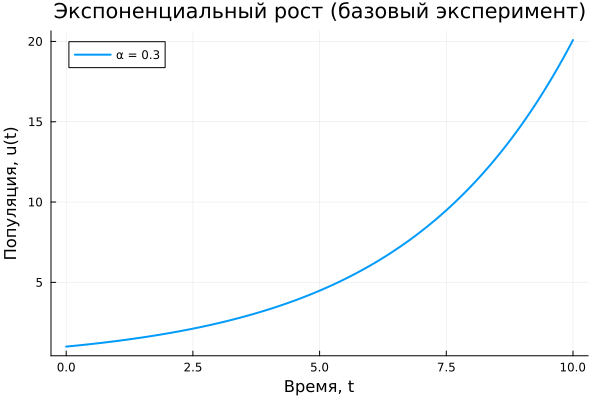
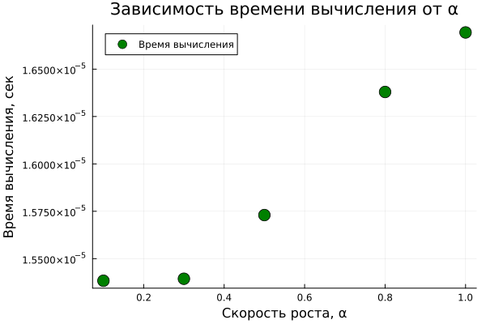

---
## Front matter
lang: ru-RU
title: Лабораторная работа №1
subtitle:  Методы математического моделирования в кибербезопасности. Практикум
author: |
        Коняева Марина Александровна
        \        
        НФИмд-01-25
        \
        Студ. билет: 1032259383
institute: |
           RUDN
date: | 
      2026

babel-lang: russian
babel-otherlangs: english
mainfont: Arial
monofont: Courier New
fontsize: 9pt

## Formatting
toc: false
slide_level: 2
theme: metropolis
header-includes: 
 - \metroset{progressbar=frametitle,sectionpage=progressbar,numbering=fraction}
 - '\makeatletter'
 - '\beamer@ignorenonframefalse'
 - '\makeatother'
aspectratio: 43
section-titles: true
---

# Цель работы

- Изучить модель экспоненциального роста и её математическое описание  
- Получить аналитическое решение дифференциального уравнения
- Провести параметрический анализ влияния коэффициента роста $\alpha$
- Проанализировать:
  - динамику роста $u(t)$
  - время удвоения $T_2$
  - вычислительные характеристики

# Задание

- Рассмотреть модель экспоненциального роста
- Изучить её математическое описание
- Провести вычислительный эксперимент при разных значениях $\alpha$
- Визуализировать результаты

# Дифференциальное уравнение

Экспоненциальный рост описывается уравнением:

$$
\frac{du}{dt} = \alpha u
$$

Где:

- $u$ — значение величины (популяция, капитал и т.п.)
- $t$ — время
- $\alpha$ — параметр роста  
  - $\alpha>0$ — рост  
  - $\alpha<0$ — затухание

# Решение и характеристики

Решение ДУ:

$$
u(t) = u_0 e^{\alpha t}
$$

Время удвоения:

$$
T_2 = \frac{\ln(2)}{\alpha} \approx \frac{0.693}{\alpha}
$$

Ключевые свойства:

- при увеличении $\alpha$ рост ускоряется
- время удвоения уменьшается

# Базовый эксперимент (α = 0.3)

- Рассмотрен рост $u(t)$ на фиксированном интервале времени
- Наблюдается ускоряющийся рост (экспонента)

# Базовый эксперимент (α = 0.3)

{width=85%}

# Влияние α на рост

- Выполнены расчёты для значений:
  - $\alpha = 0.1,\;0.3,\;0.5,\;0.8,\;1.0$
- Чем больше $\alpha$, тем быстрее система растёт

# Влияние α на рост

{width=90%}

# Время удвоения

Теоретическая зависимость:

$$
T_2 = \frac{\ln(2)}{\alpha}
$$

- Численные результаты совпадают с теорией
- При росте $\alpha$ время удвоения уменьшается

# Время удвоения

{width=85%}

# Время вычислений

- Оценена зависимость времени расчёта от $\alpha$
- Изменения носят слабый характер

# Время вычислений

{width=85%}

# Выводы

- Численные эксперименты подтвердили теоретические зависимости
- При увеличении $\alpha$:
  - рост ускоряется
  - время удвоения уменьшается
  - вычислительная нагрузка растёт незначительно
