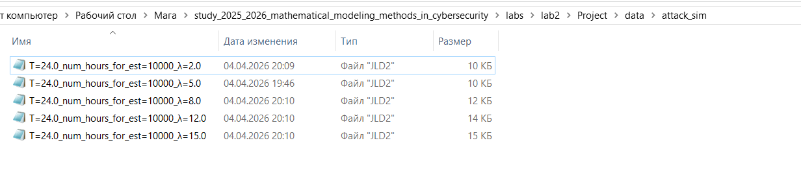
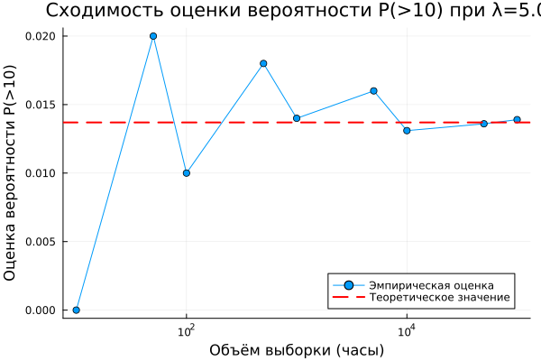
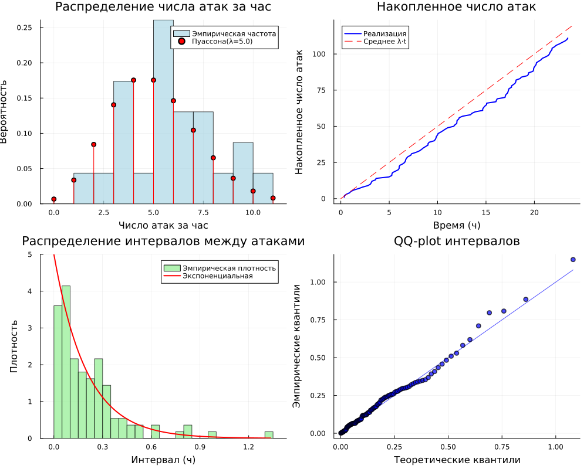
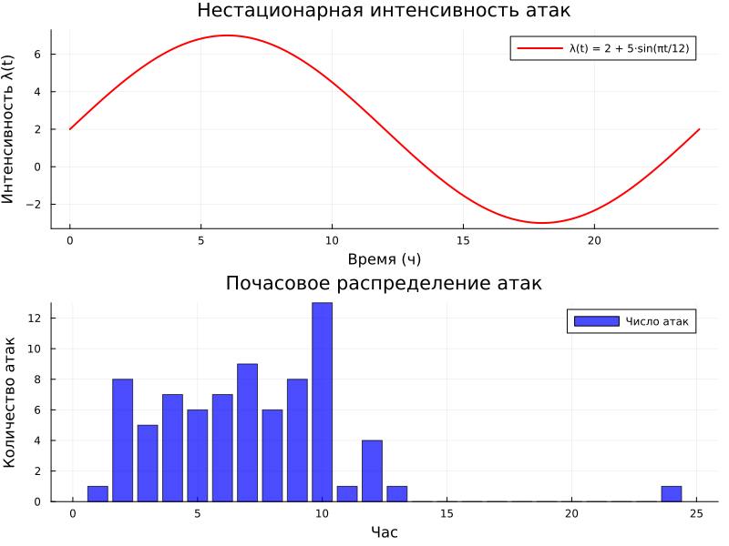

---
## Front matter
lang: ru-RU
title: Лабораторная работа №2
subtitle:  Методы математического моделирования в кибербезопасности. Практикум
author: |
        Коняева Марина Александровна
        \        
        НФИмд-01-25
        \
        Студ. билет: 1032259383
institute: |
           RUDN
date: | 
      2026

babel-lang: russian
babel-otherlangs: english
mainfont: Arial
monofont: Courier New
fontsize: 9pt

## Formatting
toc: false
slide_level: 2
theme: metropolis
header-includes: 
 - \metroset{progressbar=frametitle,sectionpage=progressbar,numbering=fraction}
 - '\makeatletter'
 - '\beamer@ignorenonframefalse'
 - '\makeatother'
aspectratio: 43
section-titles: true
---

# Цель работы

Освоить базовые методы вероятностного моделирования случайных процессов в контексте кибербезопасности.

На примере моделирования потока атак на веб-сервер изучить:

- генерацию случайных величин с заданным распределением;
- статистический анализ смоделированных данных;
- проверку соответствия эмпирического распределения теоретическому;
- оценку вероятностей редких событий;
- определить набор параметров модели (интенсивность атак, длительность наблюдения и т.д.);
- реализовать симуляцию пуассоновского потока атак;
- выполнить статистический анализ результатов;
- визуализировать данные и проверить соответствие теоретическим распределениям.

# Задание

1. Создать проект DrWatson с именем project.
2. Определить набор параметров модели (словарь params) с возможностью варьирования.
3. Написать функцию simulate_attacks(params), которая возвращает структуру с результатами симуляции (например, массив числа атак по часам, интервалы, моменты времени).
4. Использовать produce_or_load для запуска симуляции с заданными параметрами и сохранения результатов на диск.
5. Провести серию экспериментов с разными значениями параметров (например, разные $\lambda$, разная длительность).
6. Загрузить сохранённые результаты и выполнить:
   - построение гистограммы числа атак за час и сравнение с теоретическим распределением Пуассона;
   - построение графика накопленного числа атак и интервалов между атаками;
   - проверку экспоненциальности интервалов (гистограмма, QQ-plot, возможно критерий согласия);
   - оценку вероятности события «более 10 атак за час» теоретически и эмпирически.
7. Проанализировать зависимость точности оценки вероятности от числа симуляций.

# Теоретическое введение

Во многих задачах кибербезопасности поток атак (или инцидентов) можно приближённо считать простейшим (пуассоновским) потоком. Для такого потока число событий $N_t$ за время $t$ распределено по закону Пуассона:

$$P(N_t = k) = \frac{(\lambda t)^k}{k!} e^{-\lambda t}, \quad k = 0, 1, 2, \dots$$

где $\lambda$ — интенсивность потока (среднее число событий в единицу времени).

В простейшем потоке интервалы времени между соседними событиями $\tau_1, \tau_2, \dots$ независимы и имеют экспоненциальное распределение с параметром $\lambda$:

$$f(\tau) = \lambda e^{-\lambda \tau}, \quad \tau \geq 0$$

Среднее значение интервала: $\mathbb{E}[\tau] = 1/\lambda$.

# Выполнение лабораторной работы

## Подготовка проекта

```
using Pkg
Pkg.activate(".")
Pkg.add("DrWatson")
Pkg.add("Distributions")
Pkg.add("Plots")
Pkg.add("StatsPlots")
Pkg.add("DataFrames")
Pkg.add("JLD2")
Pkg.add("Random")
Pkg.add("Statistics")
Pkg.add("CSV")
Pkg.add("HypothesisTests")
```
# Выполнение лабораторной работы

## Конвейер скриптов

Представленные скрипты образуют исследовательский конвейер:

- Моделирование (simulation.jl) — вычислительное ядро.
- Генерация данных (run_experiment.jl) — получение реализаций для фиксированных параметров.
- Анализ и визуализация (analyze.jl) — проверка соответствия модели теоретическим распределениям.
- Исследование сходимости (convergence.jl) — изучение точности оценок.
- Параметрическое исследование (parameter_sweep.jl) — анализ чувствительности к изменению интенсивности.

Для выполнения работы необходимо создать проект с помощью DrWatson. Затем создадим в этом проекте скрипт src/simulation.jl, который содержит функцию simulate_attacks, реализующую вероятностную модель потока атак.

# Выполнение лабораторной работы

## Создание и инициализация проекта DrWatson

{#fig-002 width=70%}


# Выполнение лабораторной работы

## Ядро моделирования:  Файл: src/simulation.jl

Создаём файл src/simulation.jl, функция simulate_attacks реализует вероятностную модель потока атак.

Эта функция: 

- Принимает интенсивность потока $\lambda$ (среднее число атак в час) и длительность наблюдения T (в часах).
- Генерирует две реализации потока:
  - Почасовое число атак (hourly_counts) — массив длины floor(Int, T), каждый элемент — случайное число из распределения Пуассона с параметром $\lambda$.
  - Точные моменты атак — моделирование экспоненциальных интервалов между событиями до тех пор, пока их сумма не превысит T. Возвращает массив интервалов intervals и массив моментов времени attack_times (накопленные суммы).
- Возвращает NamedTuple с тремя полями: hourly_counts, intervals,
attack_times.

Результат:

- Функция не сохраняет данные самостоятельно, а лишь возвращает структуру, которая затем используется в скриптах для дальнейшего анализа или
сохранения.


# Выполнение лабораторной работы

## Запуск эксперимента с сохранением результатов: однократный запуск эксперимента

Файл *scripts/run_experiment.jl* выполняет симуляцию с заданными параметрами, вычисляет эмпирическую вероятность события «более 10 атак за час» и сохраняет все результаты на диск.
Скрипт предназначен для первичной генерации данных, которые потом будут анализироваться.

Результат:

— В папке data/attack_sim/ создаётся файл с именем, отражающим параметры (например, attack_sim_$\lambda$=5.0_T=24.0_num_hours_for_est=10000.jld2).
— Внутри — словарь с ключами: :hourly_counts, :intervals, :attack_times,
:emp_prob, :theor_prob.


# Выполнение лабораторной работы

## Анализ и визуализация результатов одного эксперимента

Файл *scripts/analyze.jl* загружает сохранённые данные и строит четыре диагностических графика,
позволяющих визуально оценить соответствие смоделированного потока теоретическим предположениям (пуассоновости и экспоненциальности).

# Выполнение лабораторной работы

## Анализ и визуализация результатов одного эксперимента

{#fig-base width=80%}


# Выполнение лабораторной работы


## Исследование сходимости оценки вероятности

Файл *scripts/convergence.jl* позволяет изучить, как быстро эмпирическая оценка вероятности редкого
события приближается к теоретическому значению при увеличении объёма
выборки.Это важный практический аспект моделирования: для надёжной оценки
редких событий требуется большой объём данных.

Результат: График, иллюстрирующий уменьшение случайной ошибки оценки с ростом
выборки, и файл с данными для повторного построения.

# Выполнение лабораторной работы

## Исследование сходимости оценки вероятности

{#fig-param width=85%}

График, иллюстрирующий уменьшение случайной ошибки оценки с ростом
выборки, и файл с данными для повторного построения.

# Выполнение лабораторной работы

## Многовариантный эксперимент: параметрическое исследование 

Файл *scripts/parameter_sweep.jl* позволяет систематически изучить, как изменение интенсивности атак $\lambda$
влияет на характеристики потока и, в частности, на вероятность P(> 10).  Скрипт автоматизирует запуск множества экспериментов, сохраняет все
результаты и строит как обобщающий график, так и детальные графики для каждого значения $\lambda$.

# Выполнение лабораторной работы

## Многовариантный эксперимент: параметрическое исследование 

{#fig-double width=80%}

Результат:

— Набор JLD2-файлов для каждого $\lambda$ в data/attack_sim/.
— Детальные графики для каждого $\lambda$ в plots/parameter_sweep/.
— Сводная таблица (CSV) и файл с данными в data/parameter_sweep/.
— Обобщающий график в корне plots/, показывающий зависимость вероятности от интенсивности.

# Выполнение лабораторной работы

## Многовариантный эксперимент: параметрическое исследование 

{#fig-double width=80%}


# Выполнение лабораторной работы

## Литературный стиль 

Преобразовываем в производные форматы с помощью файла *tangle.jl*

{#fig-time width=80%}


# Дополнительные задания 


## 1 задание

**Изменить интенсивность $\lambda$ (например, 2, 8, 12 атак/час) и сравнить результаты.**

- **При $\lambda$=2 распределение числа атак сдвинуто влево — пик около 1-2 атак за час, эмпирическая гистограмма хорошо совпадает с теоретическим Пуассоном(2). Интервалы между атаками большие — около 0.3-2 ч. Вероятность P(>10) близка к нулю (~8.3·10⁻⁶).**
- **При $\lambda$=8 распределение смещается вправо — пик около 7-8 атак за час, интервалы короткие — большинство менее 0.2 ч. Вероятность P(>10) резко возрастает (~0.184).**

{#fig-time width=80%}

# Выполнение лабораторной работы


## 2 задание

**Моделировать нестационарный пуассоновский поток с интенсивностью, зависящей от времени суток: $\lambda(𝑡) = 2 + 5 sin(\pi t/12)$. Модифицировать функцию
симуляции (использовать метод прореживания или неоднородный пуассоновский процесс).**

{#fig-time width=80%}


# Выполнение лабораторной работы

## 3 задание

**Исследовать вероятность события «ни одной атаки за смену (8 часов)» или «не менее 3 атак за 30 минут»**

{#fig-time width=80%}


# Выполнение лабораторной работы

## 4 задание

**Оценить доверительный интервал для вероятности редкого события методом
бутстрепа.**

С помощью бутстрапа и прореживания потока находим 95-проуентный ДИ и визуализируем. 

{#fig-time width=80%}


# Выполнение лабораторной работы

## 5 задание

**Добавить в модель возможность успешности атаки: каждая атака имеет вероятность успеха 𝑝, тогда успешные атаки образуют прореженный п**

Добавляем вероятность успешности атаки и рассчитываем соответствующие вероятности. 

{#fig-time width=80%}


# Выводы

1. Сформирована структура рабочего пространства на основе DrWatson, обеспечивающая разделение исходных кодов, данных и документации.
2. Реализована симуляция пуассоновского потока атак двумя способами: почасовые счётчики из распределения Пуассона и точные моменты через экспоненциальные интервалы.
3. Выполнен статистический анализ результатов: гистограммы, накопленный график, QQ-plot — все подтверждают соответствие теоретическим распределениям.
4. Проведено параметрическое исследование: показана зависимость P(>10) от интенсивности $\lambda$ — при росте $\lambda$ от 2 до 15 вероятность возрастает от ~0 до ~0.88.
5. Исследована сходимость оценки вероятности редкого события: для надёжной оценки P(>10) при $\lambda$=5 необходим объём выборки порядка 10 000–100 000 часов.
6. Выполнена интеграция вычислительных экспериментов с их описанием за счёт преобразования кода в литературный стиль.
7. Автоматизирована генерация артефактов (чистый код, Notebook, отчёт Quarto), что повышает воспроизводимость исследования.


# Список литературы

1. Описание лабораторной работы