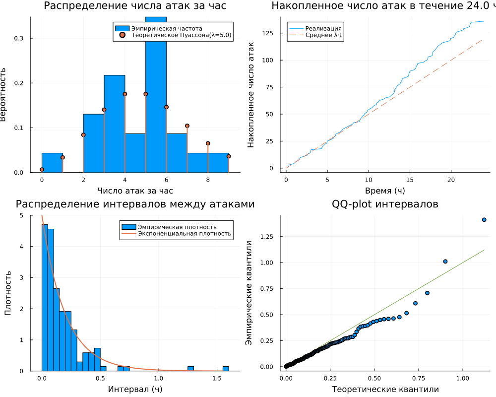
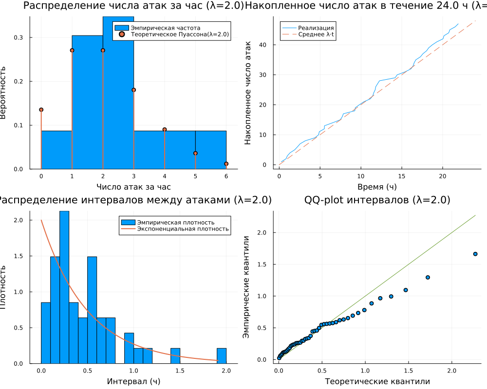
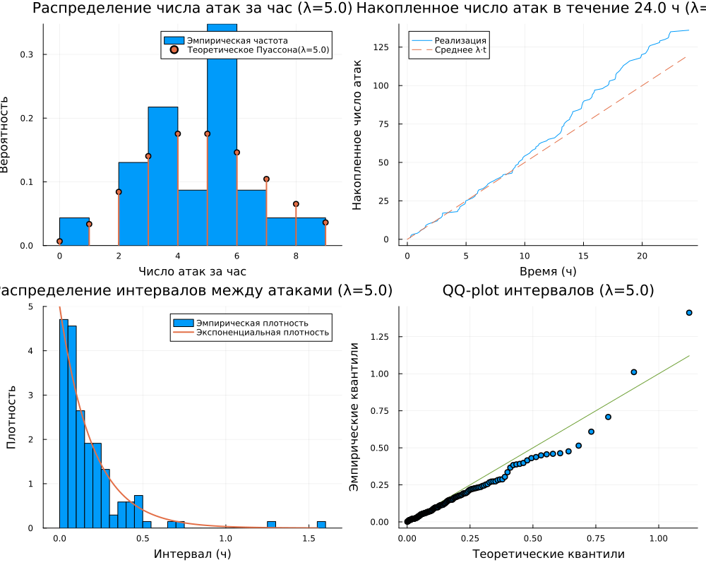
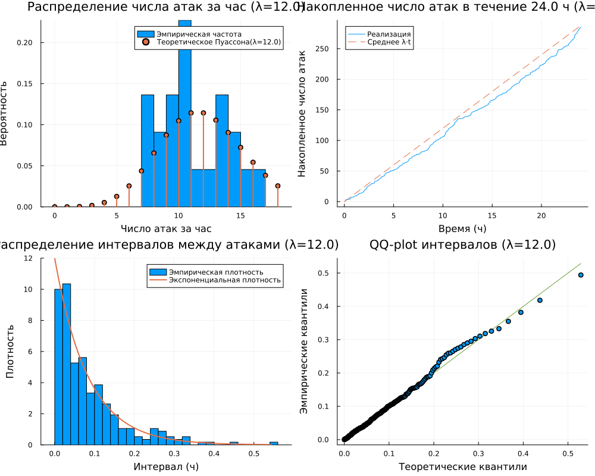
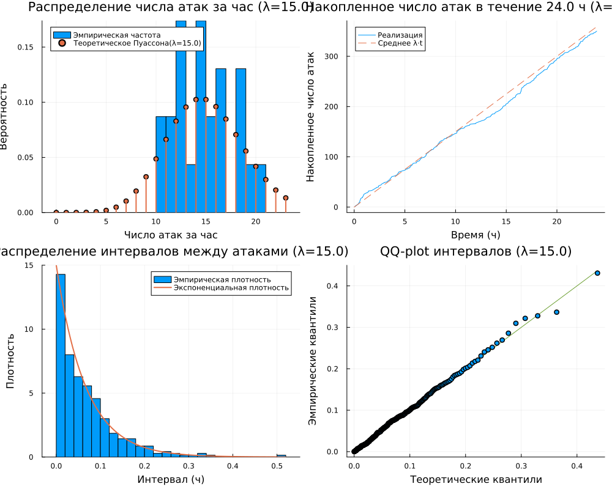
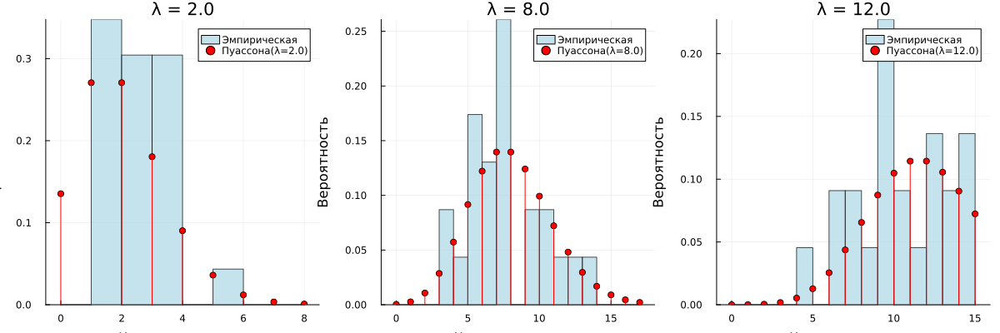
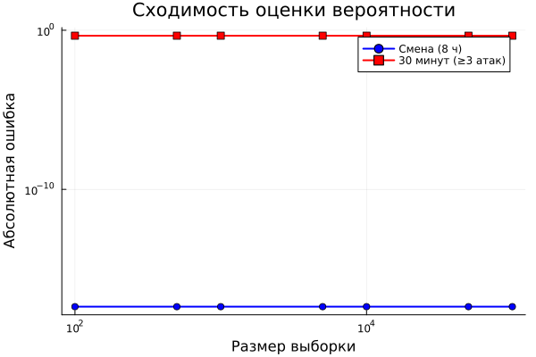
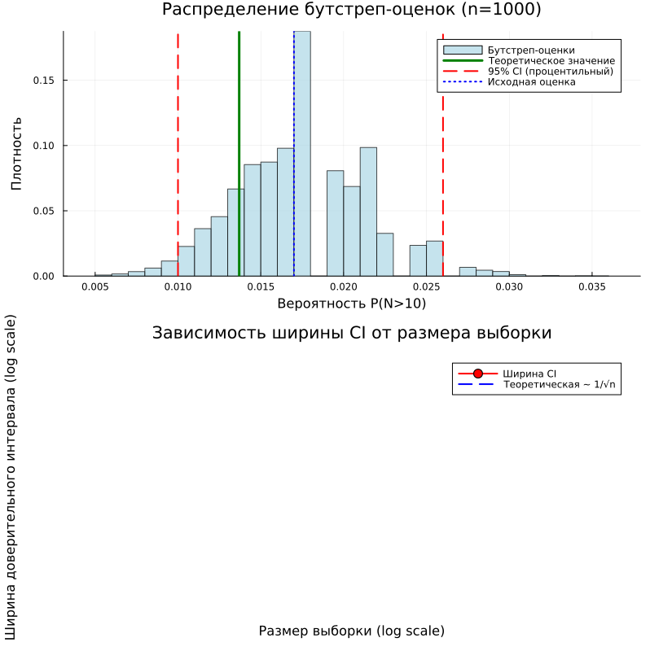
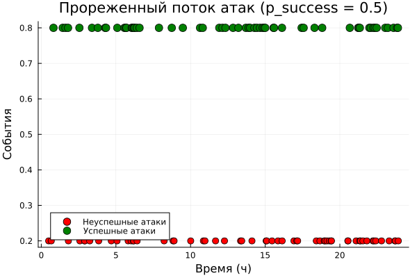

---
## Front matter
title: "ОТЧЕТ ПО ЛАБОРАТОРНОЙ РАБОТЕ №2"
subtitle: "Методы математического моделирования в кибербезопасности. Практикум"
author: "Коняева Марина Александровна"

## Generic otions
lang: ru-RU
toc-title: "Содержание"

## Bibliography
bibliography: bib/cite.bib
csl: pandoc/csl/gost-r-7-0-5-2008-numeric.csl

## Pdf output format
toc: true # Table of contents
toc-depth: 2
fontsize: 12pt
linestretch: 1.5
papersize: a4
documentclass: scrreprt
## I18n polyglossia
polyglossia-lang:
  name: russian
  options:
	- spelling=modern
	- babelshorthands=true
polyglossia-otherlangs:
  name: english
## I18n babel
babel-lang: russian
babel-otherlangs: english
## Fonts
mainfont: PT Serif
romanfont: PT Serif
sansfont: PT Sans
monofont: PT Mono
mainfontoptions: Ligatures=TeX
romanfontoptions: Ligatures=TeX
sansfontoptions: Ligatures=TeX,Scale=MatchLowercase
monofontoptions: Scale=MatchLowercase,Scale=0.9
## Biblatex
biblatex: true
biblio-style: "gost-numeric"
biblatexoptions:
  - parentracker=true
  - backend=biber
  - hyperref=auto
  - language=auto
  - autolang=other*
  - citestyle=gost-numeric
## Pandoc-crossref LaTeX customization
figureTitle: "Рис."
tableTitle: "Таблица"
listingTitle: "Листинг"
lolTitle: "Листинги"
## Misc options
indent: true
header-includes:
  - \usepackage{indentfirst}
  - \usepackage{float} # keep figures where there are in the text
  - \floatplacement{figure}{H} # keep figures where there are in the text
---


# Цель работы

Освоить базовые методы вероятностного моделирования случайных процессов в контексте кибербезопасности. На примере моделирования потока атак на веб-сервер изучить:

- генерацию случайных величин с заданным распределением;
- статистический анализ смоделированных данных;
- проверку соответствия эмпирического распределения теоретическому;
- оценку вероятностей редких событий;
- определение набора параметров модели (интенсивность атак, длительность наблюдения и т.д.);
- реализацию симуляции пуассоновского потока атак;
- визуализацию данных и проверку соответствия теоретическим распределениям.


# Задание

1. Создать проект DrWatson с именем Project.
2. Определить набор параметров модели (словарь params) с возможностью варьирования.
3. Написать функцию `simulate_attacks(params)`, которая возвращает структуру с результатами симуляции.
4. Использовать `produce_or_load` для запуска симуляции с заданными параметрами и сохранения результатов на диск.
5. Провести серию экспериментов с разными значениями параметров.
6. Загрузить сохранённые результаты и выполнить:
   - построение гистограммы числа атак за час и сравнение с теоретическим распределением Пуассона;
   - построение графика накопленного числа атак и интервалов между атаками;
   - проверку экспоненциальности интервалов (гистограмма, QQ-plot);
   - оценку вероятности события «более 10 атак за час» теоретически и эмпирически.
7. Проанализировать зависимость точности оценки вероятности от числа симуляций.
8. Выполнить все дополнительные задания.


# Теоретическое введение


## Пуассоновский поток событий

Во многих задачах кибербезопасности поток атак (или инцидентов) можно приближённо считать **простейшим (пуассоновским) потоком**, который обладает тремя свойствами:

1. **Стационарность** – вероятность появления $k$ событий за интервал времени длины $t$ зависит только от $t$ и не зависит от момента начала отсчёта.
2. **Отсутствие последействия** – число событий в непересекающихся интервалах независимы.
3. **Ординарность** – вероятность появления двух и более событий за бесконечно малый интервал времени пренебрежимо мала.

Для такого потока число событий $N_t$ за время $t$ распределено по **закону Пуассона**:

$$
P(N_t = k) = \frac{(\lambda t)^k}{k!} e^{-\lambda t}, \quad k = 0, 1, 2, \dots
$$

где $\lambda$ – **интенсивность потока** (среднее число событий в единицу времени).

## Экспоненциальное распределение интервалов

В простейшем потоке интервалы времени между соседними событиями $\tau_1, \tau_2, \dots$ независимы и имеют **экспоненциальное распределение** с параметром $\lambda$:

$$
f(\tau) = \lambda e^{-\lambda\tau}, \quad \tau \ge 0
$$

**Среднее значение интервала:**

$$
E[\tau] = \frac{1}{\lambda}
$$

## Связь с моделированием киберугроз

Пусть $\lambda$ – среднее количество успешных атак на сервер за час. Тогда:

- Количество атак за сутки (24 часа) – случайная величина, распределённая по Пуассону с параметром $24\lambda$.
- Время между атаками – экспоненциальная величина.
- Можно оценивать вероятности различных событий, например $P(\text{более 10 атак за час})$.


# Выполнение лабораторной работы

1. Создание рабочего каталога среды и проверка наличия все необходимых пакетов Julia.

```
using Pkg
Pkg.activate(".")
Pkg.add("DrWatson")
Pkg.add("Distributions")
Pkg.add("Plots")
Pkg.add("StatsPlots")
Pkg.add("DataFrames")
Pkg.add("JLD2")
Pkg.add("Random")
Pkg.add("Statistics")
Pkg.add("CSV")
Pkg.add("HypothesisTests")
```

2. Создадим отдельный файл params.jl.

```
default_params = Dict(
:λ => 5.0,
:T => 24.0,
:num_hours_for_est => 10000
)
```
3. Создание файла src/simulation.jl.

Эта функция: 

- Принимает интенсивность потока $\lambda$ (среднее число атак в час) и длительность наблюдения T (в часах).
- Генерирует две реализации потока:
  - Почасовое число атак (hourly_counts) — массив длины floor(Int, T), каждый элемент — случайное число из распределения Пуассона с параметром $\lambda$.
  - Точные моменты атак — моделирование экспоненциальных интервалов между событиями до тех пор, пока их сумма не превысит T. Возвращает массив интервалов intervals и массив моментов времени attack_times (накопленные суммы).
- Возвращает NamedTuple с тремя полями: hourly_counts, intervals,
attack_times.

Результат:

- Функция не сохраняет данные самостоятельно, а лишь возвращает структуру, которая затем используется в скриптах для дальнейшего анализа или
сохранения.

4. Запуск эксперимента с сохранением результатов. Создадим файл scripts/run_experiment.jl.

Файл вызывает simulate_attacks($\lambda$, T) для получения почасовых counts, интервалов и моментов времени, дополнительно генерирует большую выборку (num_hours_for_est) из распределения Пуассона для устойчивой оценки эмпирической вероятности
𝑃(𝑁1 > 10), вычисляет теоретическую вероятность 1 − 𝐹Poisson($\lambda$)(10), упаковывает все результаты в словарь и сохраняет в JLD2-файл (команда
@save).

Результат:

— В папке data/attack_sim/ создаётся файл с именем, отражающим параметры (например, attack_sim_$\lambda$=5.0_T=24.0_num_hours_for_est=10000.jld2).

— Внутри — словарь с ключами: :hourly_counts, :intervals, :attack_times,
:emp_prob, :theor_prob.


5. Анализ и визуализация результатов. Визуализация результатов одного эксперимента. Файл *scripts/analyze.jl* загружает сохранённые данные и строит четыре диагностических графика, позволяющих визуально оценить соответствие смоделированного потока теоретическим предположениям (пуассоновости и экспоненциальности).


{#fig-base width=80%}

6. Исследование сходимости оценки вероятности. Файл *scripts/convergence.jl* позволяет изучить, как быстро эмпирическая оценка вероятности редкого события приближается к теоретическому значению при увеличении объёма выборки.Это важный практический аспект моделирования: для надёжной оценки редких событий требуется большой объём данных.


  Activating project at `C:\Users\User\OneDrive\Рабочий стол\Мага\study_2025_2026_mathematical_modeling_methods_in_cybersecurity\labs\lab2\Project`
Вычисление оценок вероятности...
n = 10: оценка = 0.0
n = 50: оценка = 0.02
n = 100: оценка = 0.01
n = 500: оценка = 0.018
n = 1000: оценка = 0.014
n = 5000: оценка = 0.016
n = 10000: оценка = 0.0131
n = 50000: оценка = 0.0136
n = 100000: оценка = 0.0139


{#fig-param width=85%}

График, иллюстрирующий уменьшение случайной ошибки оценки с ростом
выборки, и файл с данными для повторного построения.

7. Многовариантный эксперимент. Параметрическое исследование. Файл *scripts/parameter_sweep.jl* позволяет систематически изучить, как изменение интенсивности атак $\lambda$ влияет на характеристики потока и, в частности, на вероятность 𝑃(> 10).  Скрипт автоматизирует запуск множества экспериментов, сохраняет все результаты и строит как обобщающий график, так и детальные графики для каждого значения $\lambda$.

Выполняем этот файл. Результат:

— Набор JLD2-файлов для каждого $\lambda$ в data/attack_sim/.

— Детальные графики для каждого $\lambda$ в plots/parameter_sweep/.

— Сводная таблица (CSV) и файл с данными в data/parameter_sweep/.

— Обобщающий график в корне plots/, показывающий зависимость вероятности от интенсивности.


{#fig-double width=80%}

{#fig-double width=80%}

{#fig-double width=80%}

{#fig-double width=80%}

{#fig-double width=80%}


8. Ответим на контрольные вопросы:

### Какими свойствами обладает простейший поток событий? Почему он часто используется для моделирования атак?

Простейший (пуассоновский) поток событий обладает тремя основными свойствами: стационарностью (вероятность появления k событий за интервал времени длины t зависит только от t и не зависит от момента начала отсчёта), отсутствием последействия (число событий в непересекающихся интервалах независимы) и ординарностью (вероятность появления двух и более событий за бесконечно малый интервал времени пренебрежимо мала). Он часто используется для моделирования атак, потому что поток атак в кибербезопасности приближённо соответствует этим свойствам, особенно в отсутствие целенаправленных скоординированных атак — атаки происходят случайным образом, независимо друг от друга, с постоянной средней интенсивностью, что позволяет использовать хорошо разработанный математический аппарат пуассоновских процессов.


### Как сгенерировать реализацию пуассоновского потока на интервале времени?

Существует два основных способа генерации пуассоновского потока. Первый способ: сгенерировать число событий N из распределения Пуассона с параметром λT, а затем сгенерировать N равномерно распределённых на интервале [0, T] моментов времени. Второй способ (использованный в работе): последовательно генерировать интервалы времени между событиями τ_i из экспоненциального распределения с параметром λ, накапливая их сумму до тех пор, пока она не превысит T, после чего последнее событие отбрасывается, а моменты времени атак получаются как накопленные суммы сгенерированных интервалов.


### Как проверить, что интервалы между событиями распределены экспоненциально?

Для проверки экспоненциальности интервалов используются несколько методов. Визуальные методы включают построение гистограммы эмпирической плотности распределения интервалов с наложением теоретической экспоненциальной кривой f(τ) = λe^(-λτ), а также построение QQ-графика (квантиль-квантиль), на котором точки должны лежать близко к прямой y = x, что свидетельствует о соответствии распределений. Статистические методы включают критерий Колмогорова-Смирнова, критерий Андерсона-Дарлинга и критерий хи-квадрат для формальной проверки гипотезы о принадлежности выборки экспоненциальному распределению. Также можно использовать аналитические методы: сравнение выборочного среднего с теоретическим значением 1/λ и проверку свойства отсутствия памяти экспоненциального распределения.


### В чём преимущества использования DrWatson для организации вычислительного эксперимента?

DrWatson предоставляет ряд существенных преимуществ для организации вычислительных экспериментов. Во-первых, это стандартизация структуры проекта — единая организация кода, данных, скриптов и графиков. Во-вторых, воспроизводимость результатов — автоматическое сохранение параметров экспериментов, версий кода из git и полученных результатов. В-третьих, управление окружением — активация проекта с фиксированными версиями всех используемых пакетов. В-четвёртых, автоматическое именование файлов — функция savename() генерирует уникальные имена файлов на основе параметров эксперимента. В-пятых, кэширование результатов — функция produce_or_load() позволяет избежать повторных дорогостоящих вычислений, автоматически загружая уже существующие результаты. Также DrWatson предоставляет удобные функции для доступа к стандартным директориям (datadir, plotsdir, srcdir) и пакетную обработку параметров через dict_list.


### Что такое produce_or_load и как он работает?

Produce_or_load — это ключевая функция DrWatson для управления кэшированием результатов вычислительных экспериментов. Она работает следующим образом: принимает на вход директорию для сохранения, словарь с параметрами эксперимента и функцию, которая выполняет вычисления. На основе переданных параметров функция генерирует уникальное имя файла. Затем она проверяет, существует ли уже файл с таким именем в указанной директории. Если файл существует, функция загружает данные из него и возвращает их, полностью пропуская вычисления. Если файл не существует, функция выполняет переданную пользовательскую функцию, сохраняет полученный результат в файл с сгенерированным именем и возвращает результат. Это позволяет существенно экономить время при повторных запусках экспериментов с теми же параметрами и обеспечивает воспроизводимость результатов.


### Какая структура проекта создаётся DrWatson? Для чего нужны папки data, plots, scripts, src?

DrWatson создаёт стандартизированную структуру проекта, включающую следующие директории: Project.toml и Manifest.toml — файлы с зависимостями проекта и их точными версиями; data/ — для хранения сырых и обработанных данных, результатов симуляций, кэша; plots/ — для сохранения всех генерируемых графиков в форматах PNG, PDF, SVG; scripts/ — для размещения исполняемых скриптов, которые запускают эксперименты и анализ; src/ — для хранения переиспользуемого исходного кода, модулей и функций, составляющих ядро моделирования; notebooks/ — для Jupyter ноутбуков; docs/ — для документации; papers/ — для статей; test/ — для тестов. Папка data предназначена для хранения результатов экспериментов и загруженных данных, plots — для визуализаций, scripts — для запускаемых сценариев, src — для многократно используемых функций и модулей, что обеспечивает чистоту и переиспользуемость кода.

 ```
  project/
  ├── data/         # результаты симуляций, сохранённые JLD2/CSV файлы
  ├── scripts/      # запускаемые скрипты
  ├── src/          # исходный код — функции и модули
  ├── plots/        # сохранённые графики
  ├── notebooks/    # Jupyter notebooks
  ├── markdown/     # Quarto-документация
  ├── Project.toml  # список зависимостей проекта
  └── Manifest.toml # зафиксированные версии всех пакетов
  ```


### Как задать набор параметров для множественных запусков в DrWatson?

Для множественных запусков экспериментов с разными параметрами в DrWatson используется функция dict_list. Сначала создаётся словарь param_grid, где ключами являются имена параметров, а значениями — массивы возможных значений для каждого параметра. Например, param_grid = Dict(:λ => [2.0, 5.0, 8.0], :T => [24.0], :num_hours => [10000]). Затем вызывается функция all_params = dict_list(param_grid), которая генерирует все возможные комбинации параметров в виде массива словарей. После этого можно организовать цикл for params in all_params, внутри которого для каждого набора параметров вызывается produce_or_load с текущим params. Это позволяет автоматизировать запуск серии экспериментов, причём каждый результат будет сохранён в отдельный файл с уникальным именем на основе параметров, а при повторном запуске уже выполненные эксперименты не будут пересчитываться.

9. Литературный стиль. Преобразовываем в производные форматы с помощью файла *tangle.jl*

{#fig-time width=80%}


10. Выполним дополнительные задания:
- Изменить интенсивность 𝜆 (например, 2, 8, 12 атак/час) и сравнить результаты.
 
{#fig-time width=80%}

- Моделировать нестационарный пуассоновский поток с интенсивностью, зависящей от времени суток. Модифицировать функцию симуляции (использовать метод прореживания или неоднородный пуассоновский процесс).

{#fig-time width=80%}


- Исследовать вероятность события «ни одной атаки за смену (8 часов)» или «не менее 3 атак за 30 минут».

{#fig-time width=80%}

- Оценить доверительный интервал для вероятности редкого события методом бутстрепа.

{#fig-time width=80%}


- Добавить в модель возможность успешности атаки: каждая атака имеет вероятность успеха 𝑝, тогда успешные атаки образуют прореженный пуассоновский поток. Модифицировать симуляцию и проанализировать.

{#fig-time width=80%}

{#fig-time width=80%}

{#fig-time width=80%}

{#fig-time width=80%}

{#fig-time width=80%}


# Выводы

1. Сформирована структура рабочего пространства на основе DrWatson, обеспечивающая разделение исходных кодов, данных и документации.
2. Реализована симуляция пуассоновского потока атак двумя способами: почасовые счётчики из распределения Пуассона и точные моменты через экспоненциальные интервалы.
3. Выполнен статистический анализ результатов: гистограммы, накопленный график, QQ-plot — все подтверждают соответствие теоретическим распределениям.
4. Проведено параметрическое исследование: показана зависимость P(>10) от интенсивности $\lambda$ — при росте $\lambda$ от 2 до 15 вероятность возрастает от 0 до 0.88.
5. Исследована сходимость оценки вероятности редкого события: для надёжной оценки P(>10) при $\lambda$=5 необходим объём выборки порядка 10 000–100 000 часов.
6. Выполнена интеграция вычислительных экспериментов с их описанием за счёт преобразования кода в литературный стиль.
7. Автоматизирована генерация артефактов (чистый код, Notebook, отчёт Quarto), что повышает воспроизводимость исследования.


# Список литературы

1. A Multi-Language Computing Environment for Literate Programming and Reproducible Research / E. Schulte [et al.] // Journal of Statistical Software. — 2012. — Vol. 46, no. 3.

2. Knuth D. E. Literate Programming // The Computer Journal. — 1984. — Vol. 27, no. 2. — P. 97–111.

3. The Story in the Notebook / M. B. Kery [et al.] // Proceedings of the 2018 CHI Conference on Human Factors in Computing Systems. — ACM, 2018. — P. 1–11.