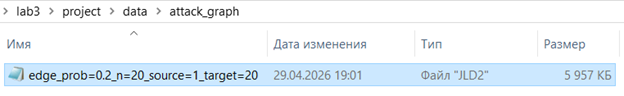
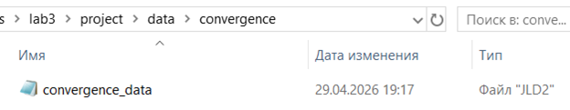
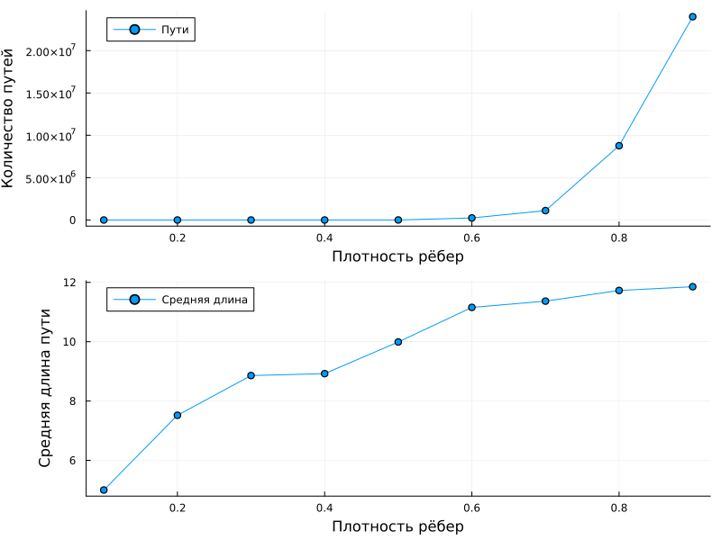
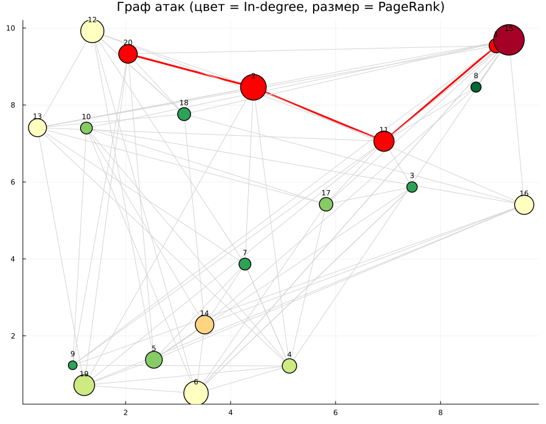

---
## Front matter
lang: ru-RU
title: Лабораторная работа №3
subtitle:  Методы математического моделирования в кибербезопасности. Практикум
author: |
        Коняева Марина Александровна
        \        
        НФИмд-01-25
        \
        Студ. билет: 1032259383
institute: |
           RUDN
date: | 
      2026

babel-lang: russian
babel-otherlangs: english
mainfont: Arial
monofont: Courier New
fontsize: 9pt

## Formatting
toc: false
slide_level: 2
theme: metropolis
header-includes: 
 - \metroset{progressbar=frametitle,sectionpage=progressbar,numbering=fraction}
 - '\makeatletter'
 - '\beamer@ignorenonframefalse'
 - '\makeatother'
aspectratio: 43
section-titles: true
---

# Цель работы

Освоить методы построения и анализа графов атак для оценки уязвимостей сетевой инфраструктуры.
На примере моделирования атак на корпоративную сеть изучить:

- представление сетевой топологии и уязвимостей в виде ориентированного графа;
- алгоритмы поиска всех возможных путей атаки от начальных точек до целевых активов;
- расчёт метрик центральности для определения критических узлов;
- визуализацию графа с цветовой индикацией уровня риска;
- оценку вероятности успешной атаки с учётом сложности эксплуатации уязвимостей.

# Задание


1. Построить граф атак для заданной топологии сети.
2. Реализовать алгоритм поиска всех путей от заданного источника к цели.
3. Рассчитать метрики центральности для всех узлов и выявить наиболее критичные.
4. Визуализировать граф, раскрашивая узлы в зависимости от степени риска.
5. Присвоить каждому ребру вес (вероятность успешной атаки) и вычислить наиболее вероятный путь атаки.


# Теоретическое введение

Граф атак — это ориентированный граф, в котором вершины представляют состояния системы (узлы сети, привилегии), а рёбра — действия атакующего по переходу между состояниями. В упрощённой модели:

- вершины — сетевые узлы (хост, сервер);
- направленные рёбра — возможность атаки с одного узла на другой.

Задача анализа графа атак сводится к нахождению всех путей от источника (злоумышленник) к цели (критический актив). 

Для выявления критичных узлов используются следующие метрики:

- **Степень центральности** — количество инцидентных рёбер (in-degree и out-degree);
- **Центральность по посредничеству** — доля кратчайших путей, проходящих через узел;
- **PageRank** — мера важности узла с учётом важности ссылающихся на него узлов.


# Выполнение лабораторной работы

## Подготовка проекта

```
using Pkg
Pkg.activate(".")
Pkg.add("DrWatson")
Pkg.add("Distributions")
Pkg.add("Plots")
Pkg.add("StatsPlots")
Pkg.add("DataFrames")
Pkg.add("JLD2")
Pkg.add("Random")
Pkg.add("Statistics")
Pkg.add("CSV")
Pkg.add("HypothesisTests")
```

# Выполнение лабораторной работы

## Ядро моделирования графа атак

Создадим отдельный файл src/attack_graph.jl. Это основной модуль, используемый всеми скриптами.

Результатом работы функций являются граф, все найденные пути атаки, метрики центральности, веса рёбер и наиболее вероятный путь.

# Выполнение лабораторной работы

##  Однократный запуск эксперимента

Создание файла scripts/ag_run_experiment.jl. 

{#fig-base width=60%}

{#fig-base width=60%}


# Выполнение лабораторной работы

## Визуализация и анализ графа

Создадим файл scripts/ag_analyze.jl.

{#fig-base width=60%}


# Выполнение лабораторной работы

## Визуализация и анализ графа

{#fig-base width=60%}


# Выполнение лабораторной работы

## Исследование масштабируемости

Создадим файл scripts/ag_convergence.jl. 

{#fig-base width=80%}

{#fig-base width=80%}

# Выполнение лабораторной работы

## Исследование масштабируемости

{#fig-base width=80%}


# Выполнение лабораторной работы

##  Параметрическое исследование

Создадим файл scripts/parameter_sweep.jl.


{#fig-base width=80%}


{#fig-base width=80%}

# Выполнение лабораторной работы

##  Параметрическое исследование

{#fig-base width=80%}


# Выполнение лабораторной работы

## Дополнительные задания 

Добавили в граф атак веса уязвимостей (CVSS) и найшли наиболее вероятный путь с помощью алгоритма Дейкстры (с учётом логарифмов вероятностей). 

{#fig-base width=80%}


# Выполнение лабораторной работы

## Дополнительные задания

Выполним дополнительное задание 2: реализовали модель распространения атаки с использованием агентного подхода.

{#fig-base width=80%}


# Выполнение лабораторной работы

## Дополнительные задания

Выполним дополнительное задание 3: сравнить разные метрики центральности и определить, какие из них лучше предсказывают узлы, наиболее уязвимые для атак.

{#fig-base width=80%}


# Выполнение лабораторной работы

## Дополнительные задания

Выполним дополнительное задание 4: использовать реальные данные о топологии сети (например, из датасетов сетей) для построения графа атак.

{#fig-base width=80%}


# Выполнение лабораторной работы

## Дополнительные задания

Выполним дополнительное задание 5: визуализировать граф с помощью интерактивных библиотек (например, GraphPlot с возможностью наведения).

{#fig-base width=80%}


# Выполнение лабораторной работы

## Дополнительные задания

Выполним дополнительное задание 6: оценить эффективность защитных мер (например, изоляция узла с высокой betweenness centrality) на снижение числа путей атаки.

{#fig-base width=80%}


# Выполнение лабораторной работы

## Контрольные вопросы

Ответили на все контрольные вопросы лабораторной работы.

# Выводы

В ходе выполнения лабораторной работы были освоены методы построения и анализа графов атак. Были выполнены все задания лабораторной работы, также дополнительные и ответили на все контрольные вопросы.


# Список литературы

1. Описание лабораторной работы