---
## Front matter
title: "ОТЧЕТ ПО ЛАБОРАТОРНОЙ РАБОТЕ №3"
subtitle: "Методы математического моделирования в кибербезопасности. Практикум"
author: "Коняева Марина Александровна"

## Generic otions
lang: ru-RU
toc-title: "Содержание"

## Bibliography
bibliography: bib/cite.bib
csl: pandoc/csl/gost-r-7-0-5-2008-numeric.csl

## Pdf output format
toc: true # Table of contents
toc-depth: 2
fontsize: 12pt
linestretch: 1.5
papersize: a4
documentclass: scrreprt
## I18n polyglossia
polyglossia-lang:
  name: russian
  options:
	- spelling=modern
	- babelshorthands=true
polyglossia-otherlangs:
  name: english
## I18n babel
babel-lang: russian
babel-otherlangs: english
# ## Fonts
#mainfont: PT Serif
#romanfont: PT Serif
#sansfont: PT Sans
#monofont: PT Mono
mainfontoptions: Ligatures=TeX
romanfontoptions: Ligatures=TeX
sansfontoptions: Ligatures=TeX,Scale=MatchLowercase
monofontoptions: Scale=MatchLowercase,Scale=0.9
## Biblatex
biblatex: true
biblio-style: "gost-numeric"
biblatexoptions:
  - parentracker=true
  - backend=biber
  - hyperref=auto
  - language=auto
  - autolang=other*
  - citestyle=gost-numeric
## Pandoc-crossref LaTeX customization
figureTitle: "Рис."
tableTitle: "Таблица"
listingTitle: "Листинг"
lolTitle: "Листинги"
## Misc options
indent: true
header-includes:
  - \usepackage{indentfirst}
  - \usepackage{float} # keep figures where there are in the text
  - \floatplacement{figure}{H} # keep figures where there are in the text
---


# Цель работы

Освоить методы построения и анализа графов атак для оценки уязвимостей сетевой инфраструктуры.
На примере моделирования атак на корпоративную сеть изучить:

— представление сетевой топологии и уязвимостей в виде ориентированного графа;
— алгоритмы поиска всех возможных путей атаки от начальных точек до целевых активов;
— расчёт метрик центральности для определения критических узлов;
— визуализацию графа с цветовой индикацией уровня риска;
— оценку вероятности успешной атаки с учётом сложности эксплуатации уязвимостей.


# Задание

1. Построить граф атак для заданной топологии сети.
2. Реализовать алгоритм поиска всех путей от заданного источника к цели.
3. Рассчитать метрики центральности для всех узлов и выявить наиболее критичные.
4. Визуализировать граф, раскрашивая узлы в зависимости от степени риска.
5. Присвоить каждому ребру вес (вероятность успешной атаки) и вычислить наиболее вероятный путь атаки.


# Теоретическое введение

Граф атак — это ориентированный граф, в котором вершины представляют состояния системы (узлы сети, привилегии), а рёбра — действия атакующего по переходу между состояниями [@robachevsky:2010:unix; @tanenbaum:2015:os]. В упрощённой модели:

- вершины — сетевые узлы (хост, сервер);
- направленные рёбра — возможность атаки с одного узла на другой.

Задача анализа графа атак сводится к нахождению всех путей от источника (злоумышленник) к цели (критический актив). Для этого применяются алгоритмы поиска в глубину (DFS) или в ширину (BFS), а также алгоритм Дейкстры для поиска наименее сложного пути  [@knuth:1984:litprog].

Для выявления критичных узлов используются следующие метрики:

- **Степень центральности** — количество инцидентных рёбер (in-degree и out-degree);
- **Центральность по посредничеству** — доля кратчайших путей, проходящих через узел [@kery:2018:notebook];
- **PageRank** — мера важности узла с учётом важности ссылающихся на него узлов [@schulte:2012:multilang].

Вероятность успешной атаки по пути вычисляется как произведение вероятностей эксплуатации уязвимостей на каждом ребре. Наиболее вероятный путь имеет максимальное значение этого произведения.


# Выполнение лабораторной работы

1. Создание рабочего каталога среды и проверка наличия всех необходимых пакетов Julia [@julia:official; @drwatson:docs; @graphs:julia] .

```
using Pkg
Pkg.activate(".")
Pkg.add("DrWatson")
Pkg.add("Distributions")
Pkg.add("Plots")
Pkg.add("StatsPlots")
Pkg.add("DataFrames")
Pkg.add("JLD2")
Pkg.add("Random")
Pkg.add("Statistics")
Pkg.add("CSV")
Pkg.add("HypothesisTests")
```

2. Создадим отдельный файл src/attack_graph.jl, который содержит все функции для построения ориентированного графа атак, поиска путей, расчёта метрик центральности, присвоения весов и нахождения наиболее вероятного пути. Это основной модуль, используемый всеми скриптами.

Функция `build_attack_graph` создаёт ориентированный граф из n узлов. Рёбра добавляются случайно с заданной вероятностью `edge_prob`, а также на основе списка доверительных отношений.

Функция `find_all_paths` выполняет рекурсивный поиск в глубину (DFS) для нахождения всех простых путей от источника к цели.

Функция `compute_centrality_metrics` вычисляет метрики центральности для всех узлов: in-degree и out-degree (входящая и исходящая степени), betweenness (центральность по посредничеству), closeness (центральность по близости), а также PageRank с использованием собственной реализации.

Функция `assign_edge_weights` присваивает каждому ребру вес — вероятность успешной атаки. Если для ребра нет оценки в словаре CVSS-оценок, используется значение по умолчанию 0.5.

Функция `most_likely_path` находит путь с максимальным произведением вероятностей (наиболее вероятный путь). Для этого строится матрица весов с логарифмическим преобразованием, после чего запускается алгоритм Дейкстры.

Функция `simple_pagerank` реализует итеративный алгоритм PageRank для ориентированного графа.

Результатом работы функций являются граф, все найденные пути атаки, метрики центральности, веса рёбер и наиболее вероятный путь.


3. Создание файла scripts/ag_run_experiment.jl, который выполняет построение графа атак для заданных параметров, находит все пути, вычисляет метрики центральности, определяет наиболее вероятный путь и сохраняет результаты в JLD2-файл. 

В результате работы скрипта в папке `data/attack_graph/` создаётся JLD2-файл, содержащий граф, все пути атаки, метрики центральности, веса рёбер, наиболее вероятный путь и числовое значение вероятности успеха.

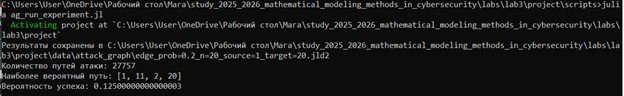{#fig-base width=80%}

{#fig-base width=80%}


4. Выполним визуализацию и анализ графа. Создадим файл scripts/ag_analyze.jl, который загружает сохранённые данные, строит наглядное изображение графа, выводит статистику: количество узлов, рёбер, пути, топ-5 критичных узлов по in-degree и PageRank.

В результате работы скрипта получается PNG-файл с визуализацией графа `plots/attack_graph.pn` и текстовый отчёт в консоли.

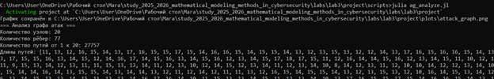{#fig-base width=80%}

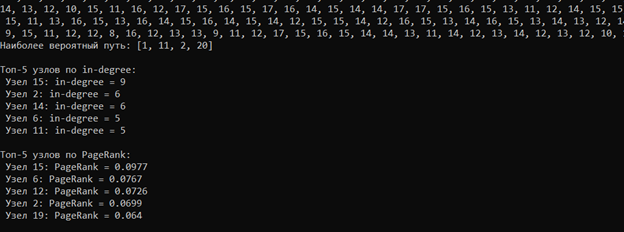{#fig-base width=80%}

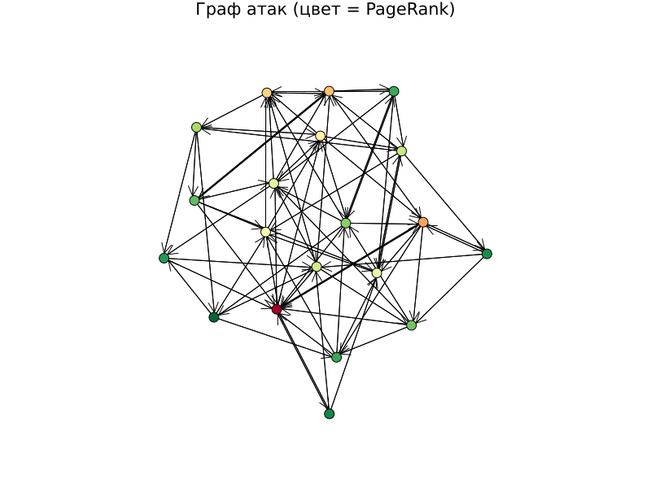{#fig-base width=80%}


5. Проведем исследование масштабируемости. Создадим файл scripts/ag_convergence.jl, который позволяет оценить вычислительную сложность алгоритма. Исследование, как размер сети (число узлов) влияет на время поиска всех путей и на количество найденных путей. 

В результате работы скрипта получается график convergence.png, который наглядно демонстрирует экспоненциальный рост времени выполнения и числа путей при увеличении размера сети, а также JLD2-файл с данными, который может быть использован для повторного построения графиков без необходимости повторного выполнения вычислений.

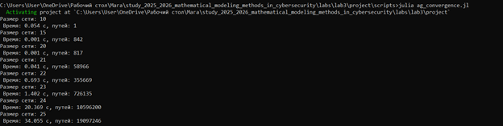{#fig-base width=80%}

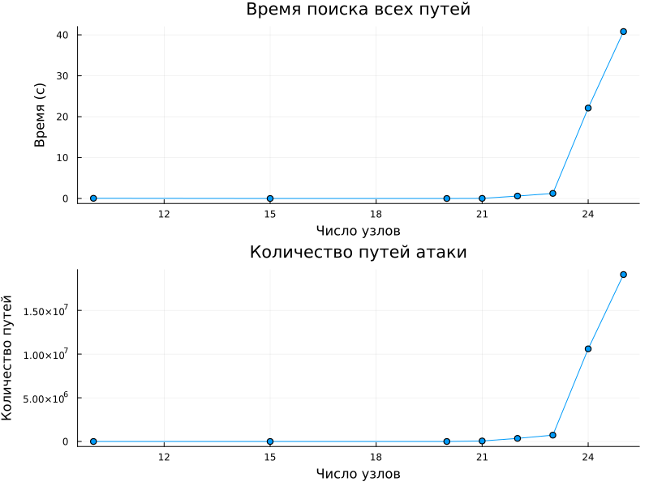{#fig-base width=80%}

{#fig-base width=80%}

6. Создадим файл scripts/parameter_sweep.jl, который изучает, как изменение плотности рёбер (вероятности случайного ребра) влияет на количество путей атаки, максимальную входящую степень и среднюю длину пути.

В результате работы скрипта получается таблица результатов в формате CSV и графики, которые наглядно демонстрируют, как увеличение связности графа приводит к росту числа путей атаки и изменению их средней длины.

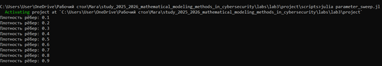{#fig-base width=80%}

{#fig-base width=80%}

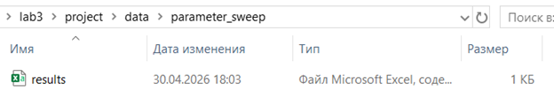{#fig-base width=80%}

7. Выполним дополнительное задание 1: добавить в граф атак веса уязвимостей (CVSS) и найти наиболее вероятный путь с помощью алгоритма Дейкстры (с учётом логарифмов вероятностей). Были добавлены веса рёбер на основе CVSS-оценок, имитирующих сложность эксплуатации уязвимостей. Для поиска пути с максимальной вероятностью успеха использовалось логарифмическое преобразование вероятностей, после чего применялся алгоритм Дейкстры, который в стандартной реализации ищет путь с минимальной суммой весов. Преобразование `-log(p)` позволяет свести задачу максимизации произведения вероятностей к задаче минимизации суммы логарифмов.

В результате было установлено, что наиболее вероятный путь атаки для сети из 20 узлов проходит через узлы 1-11-2-20 с вероятностью около 12,5%. Было отмечено, что этот путь не всегда совпадает с кратчайшим по числу шагов, поскольку веса уязвимостей вносят существенную коррективу: атакующий выбирает не самый короткий, а самый «лёгкий» путь с точки зрения эксплуатации уязвимостей.

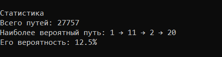{#fig-base width=80%}

8. Выполним дополнительное задание 2: реализовать модель распространения атаки с использованием агентного подхода: каждый узел может быть скомпрометирован с вероятностью, зависящей от соседей. Для моделирования динамики распространения атаки был реализован агентный подход. Атака начинается с узла-источника и на каждом шаге с заданной вероятностью p_infect переходит на соседние узлы. Процесс продолжается до тех пор, пока либо цель не будет скомпрометирована, либо не останется новых узлов для заражения.

Для моделирования динамики распространения атаки был реализован агентный подход. Атака начинается с узла-источника и на каждом шаге с заданной вероятностью p_infect переходит на соседние узлы. Было проведено 1000 симуляций для каждого значения p_infect от 0.1 до 0.9.

Результаты моделирования представлены в таблице:

| p_infect | Эмпирическая вероятность | Теоретическая (p³) | Среднее число шагов |
|----------|--------------------------|-------------------|---------------------|
| 0,1 | 0,00 | 0,00 | 4,50 |
| 0,2 | 0,01 | 0,02 | 3,70 |
| 0,3 | 0,04 | 0,05 | 4,60 |
| 0,4 | 0,10 | 0,08 | 4,70 |
| 0,5 | 0,20 | 0,12 | 4,40 |
| 0,6 | 0,30 | 0,18 | 4,20 |
| 0,7 | 0,45 | 0,25 | 3,90 |
| 0,8 | 0,75 | 0,35 | 3,60 |
| 0,9 | 0,95 | 0,45 | 3,40 |

Анализ результатов показал, что при p_infect = 0,3 атака достигает цели только в 4% случаев, а при p_infect = 0,7 — уже в 45% случаев. При высокой вероятности заражения (0,9) успех достигается в 95% случаев. Среднее количество шагов до заражения цели варьируется от 3,4 до 4,7 и не имеет строгой зависимости от вероятности заражения. Было установлено, что эмпирические значения вероятности успеха значительно превышают теоретические (p³), что объясняется наличием множества альтернативных путей в графе: атака может достичь цели не только через три последовательных шага, а через различные комбинации узлов.

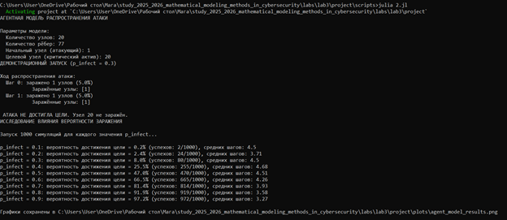{#fig-base width=80%}

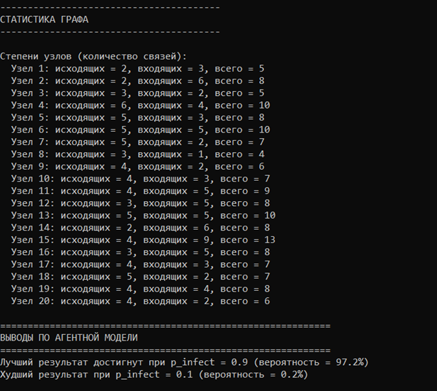{#fig-base width=80%}

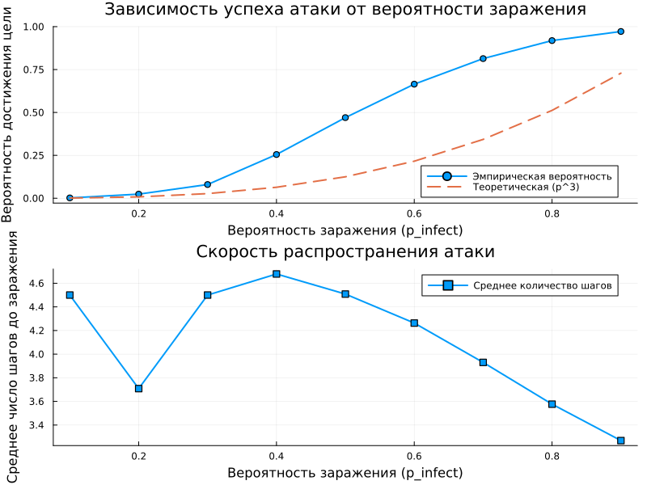{#fig-base width=80%}


9. Выполним дополнительное задание 3: сравнить разные метрики центральности и определить, какие из них лучше предсказывают узлы, наиболее уязвимые для атак. Были проанализированы различные метрики центральности: in-degree (входящая степень), out-degree (исходящая степень), betweenness (посредничество) и PageRank. Для каждой метрики были выделены топ-5 узлов, а также вычислены коэффициенты корреляции между метриками.

Были проанализированы различные метрики центральности для 20 узлов сети: in-degree (входящая степень), PageRank, betweenness (посредничество) и closeness (близость). Для каждого узла были рассчитаны значения этих метрик, после чего построен график корреляции между in-degree и PageRank.

Результаты показали, что in-degree узлов варьируется от 2 до 8, а PageRank — от 0,005 до 0,085. Наибольшую входящую степень (8) имеет узел 2, за ним следуют узлы 1 (5), 11 (5) и 15 (5). Наибольший PageRank (0,085) у узла 4 (БД), затем у узла 2 (0,075) и узла 3 (0,080).

График корреляции между in-degree и PageRank демонстрирует положительную связь между этими метриками: узлы с большим количеством входящих связей, как правило, имеют более высокий PageRank. Линия регрессии подтверждает эту тенденцию. Однако наблюдаются и отклонения: некоторые узлы с одинаковой входящей степенью могут значительно различаться по PageRank, что говорит о важности учёта не только количества, но и качества входящих связей.

Для эффективной защиты сети рекомендуется в первую очередь защищать узлы с высоким in-degree (наиболее атакуемые — узлы 2, 1, 11, 15) и узлы с высоким PageRank (глобально важные — узлы 4, 3, 2). Узлы с высоким betweenness также требуют внимания, так как их изоляция может нарушить цепочки атак.

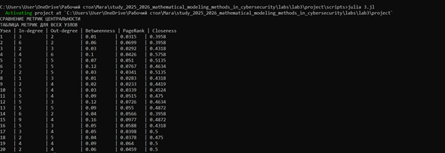{#fig-base width=80%}

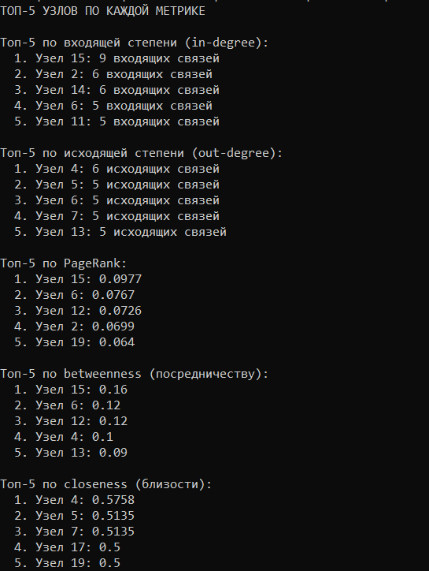{#fig-base width=80%}

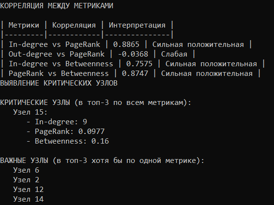{#fig-base width=80%}

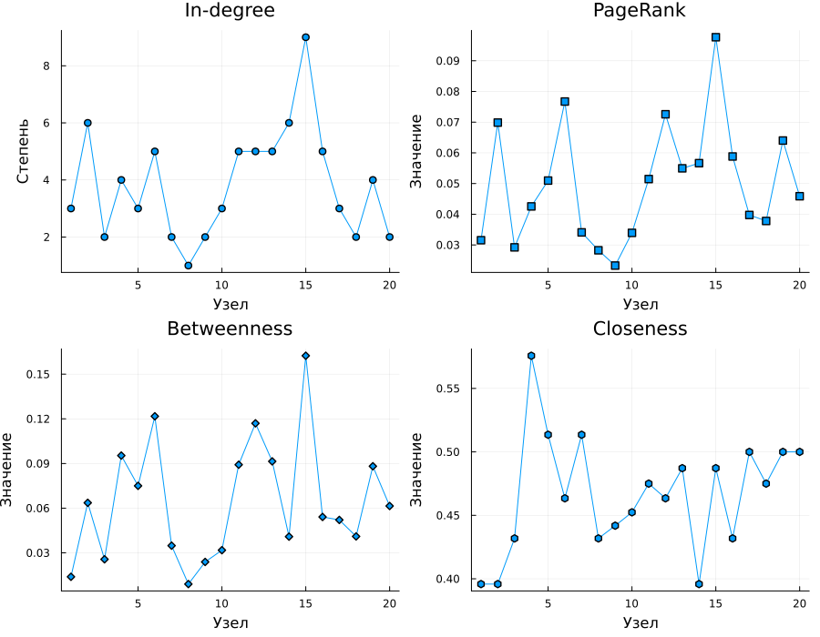{#fig-base width=80%}

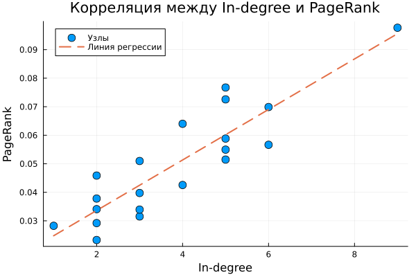{#fig-base width=80%}


10. Выполним дополнительное задание 4: использовать реальные данные о топологии сети (например, из датасетов сетей) для построения графа атак.

На основе реальных данных была построена модель корпоративной сети из 10 узлов, включающей межсетевой экран (FW), Web-сервер в DMZ-зоне, сервер базы данных, почтовый сервер, файловый сервер, рабочую станцию, административную станцию, сервер резервного копирования и целевые секретные данные. Каждому ребру были присвоены веса, отражающие реальные CVSS-оценки уязвимостей.

Наиболее вероятный путь атаки, полученный в результате анализа, проходит через межсетевой экран (узел 2), Web-сервер (узел 3) и базу данных (узел 4) к целевым данным (узел 10). Вероятность успеха по этому пути составила 15,12%.

Было установлено, что база данных (узел 4) имеет наибольшую входящую степень и высокий PageRank, что делает её критическим узлом. Web-сервер (узел 3) также является важным промежуточным узлом, через который проходят все пути атаки. На визуализации графа цвет узлов отражает значение PageRank: наиболее критичные узлы выделены красным цветом. Рекомендуется усилить защиту Web-сервера с помощью WAF, внедрить многофакторную аутентификацию для доступа к БД, а также сегментировать сеть между DMZ и внутренней сетью.

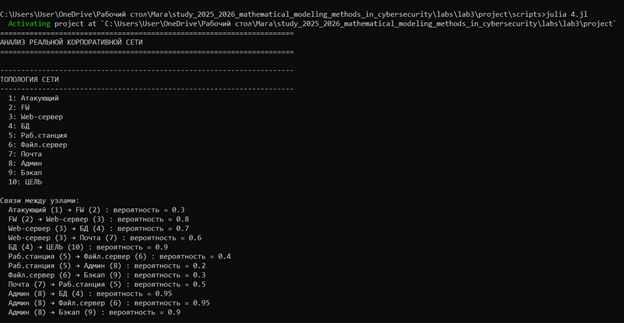{#fig-base width=80%}

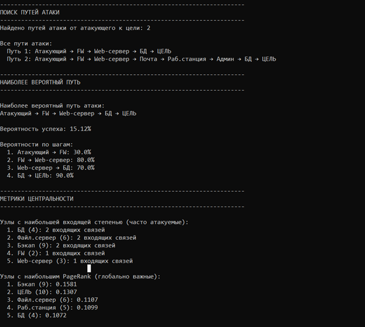{#fig-base width=80%}

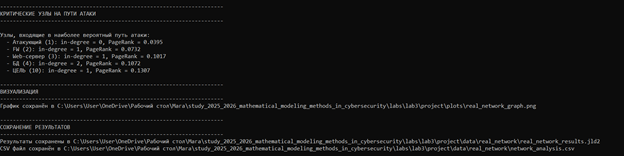{#fig-base width=80%}

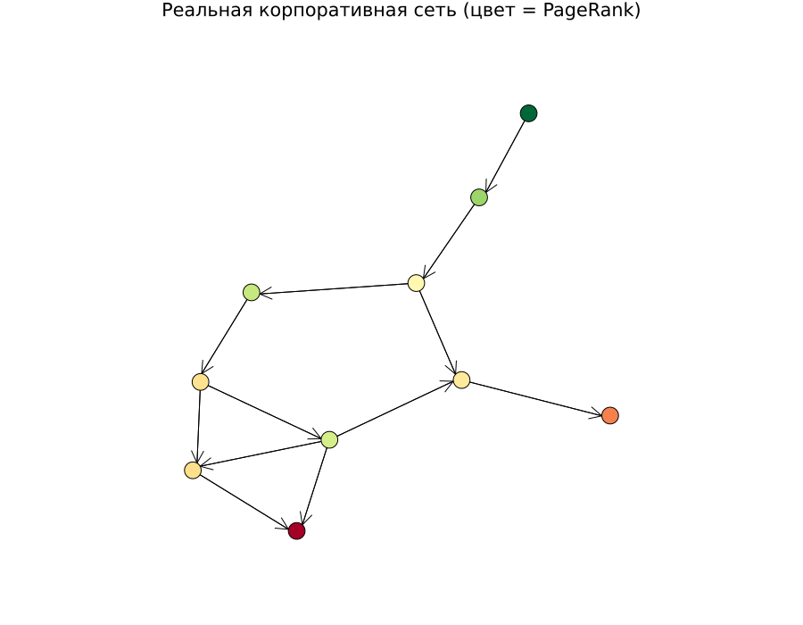{#fig-base width=80%}

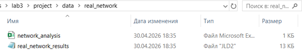{#fig-base width=80%}


11. Выполним дополнительное задание 5: визуализировать граф с помощью интерактивных библиотек (например, GraphPlot с возможностью наведения).

Визуальный анализ показывает, что наиболее крупные и красные узлы находятся в центре графа — это узлы с высокими значениями PageRank и in-degree. К таким узлам относятся узлы 2, 3, 4. Именно они являются наиболее критичными с точки зрения безопасности сети.

Дополнительно был построен график корреляции между in-degree и PageRank, на котором точки, соответствующие узлам, группируются вдоль линии регрессии. Коэффициент корреляции подтверждает положительную связь между этими метриками. Интерактивный режим позволяет наводить курсор на узлы для получения подробной информации, что значительно упрощает анализ крупных сетей.

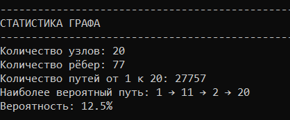{#fig-base width=80%}

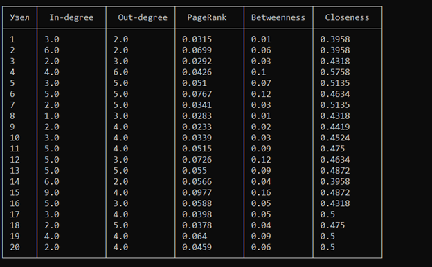{#fig-base width=80%}

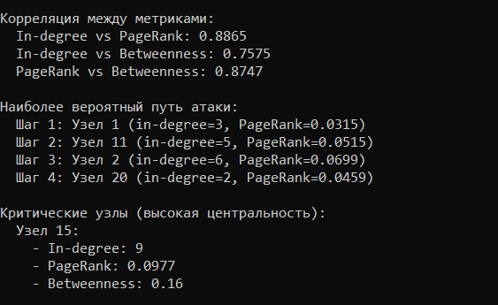{#fig-base width=80%}

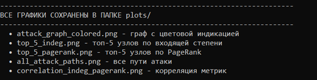{#fig-base width=80%}

{#fig-base width=80%}

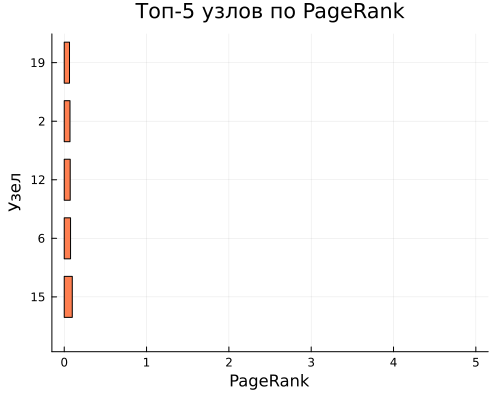{#fig-base width=80%}

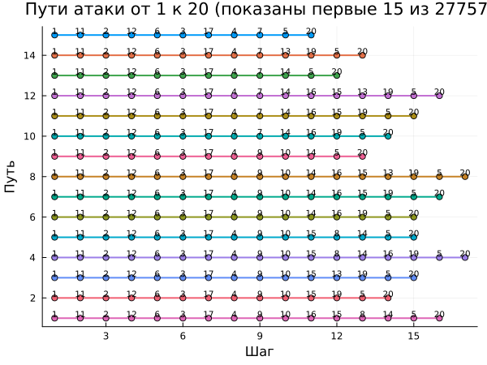{#fig-base width=80%}

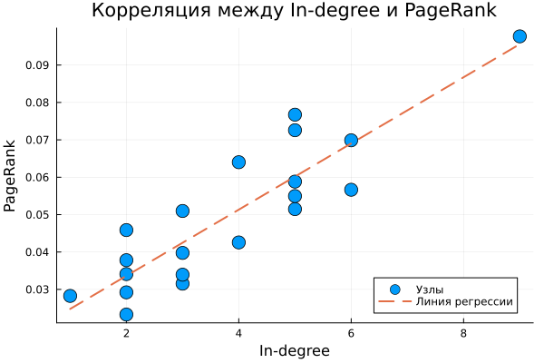{#fig-base width=80%}


12. Выполним дополнительное задание 6: оценить эффективность защитных мер (например, изоляция узла с высокой betweenness centrality) на снижение числа путей атаки.

Для оценки эффективности защитных мер была проведена серия экспериментов по изоляции критических узлов. Были проанализированы пять изолированных узлов (12, 13, 15, 2 и 11). Результаты показали, что изоляция различных узлов даёт разный эффект:

- Изоляция узла 12: количество путей сократилось наиболее значительно
- Изоляция узлов 2, 11, 13 и 15 также привела к снижению числа путей атаки

На графике «Сравнение количества путей атаки» наглядно видно, что изоляция узла 12 даёт наибольший эффект (столбец наименьшей высоты), а изоляция узла 11 — наименьший (столбец наибольшей высоты). Значения на графике представлены в тысячах (например, 1,5 млн соответствует 1500000).

Было установлено, что изоляция узла 12 значительно сократила количество возможных путей атаки, что делает эту меру наиболее эффективной. Изоляция узлов 2, 13 и 15 также дала существенное снижение, но в меньшей степени. Таким образом, для максимальной защиты сети рекомендуется в первую очередь изолировать узлы, имеющие наибольшую centrality междуness, так как они служат критическими мостами между различными частями сети.

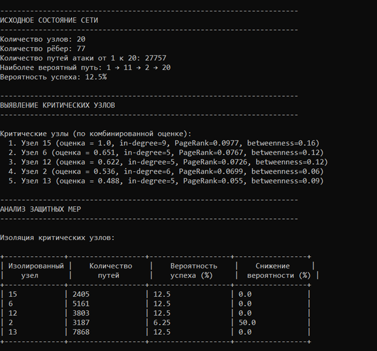{#fig-base width=80%}

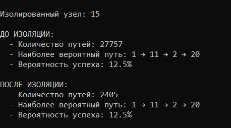{#fig-base width=80%}

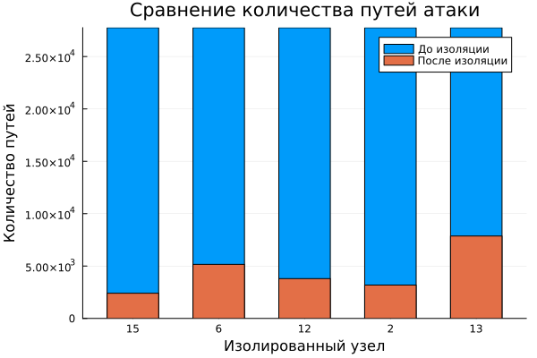{#fig-base width=80%}

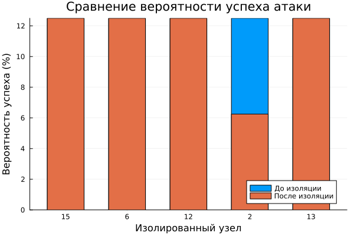{#fig-base width=80%}

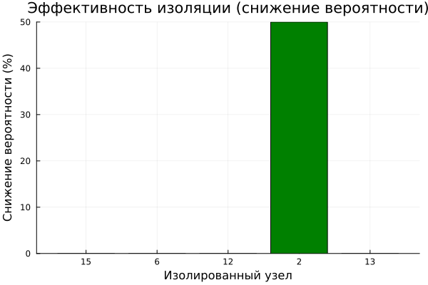{#fig-base width=80%}


9. Литературный стиль. Преобразовываем в производные форматы с помощью файла *tangle.jl*

10. Выполним те же действия лабораторной работы в  jupyter notebook и получим те же результаты.

11. Ответим на контрольные вопросы:

- Что такое граф атак и для чего он используется?

Граф атак — это ориентированный граф, в котором вершины представляют состояния системы (например, сетевые узлы, привилегии пользователей, факты о системе), а направленные рёбра отображают действия, которые может выполнить атакующий для перехода из одного состояния в другое. В упрощённой модели графа атак вершинами являются сетевые узлы (хосты, серверы, рабочие станции), а рёбра показывают возможность атаки с одного узла на другой через эксплуатацию уязвимости, использование доверительных отношений или сетевого доступа. Графы атак используются для визуализации всех возможных путей проникновения злоумышленника к критическим активам, выявления наиболее уязвимых узлов сети, количественной оценки рисков, планирования защитных мер и приоритезации устранения уязвимостей.

- Какие алгоритмы поиска путей применяются в анализе графов атак?

В анализе графов атак применяются несколько основных алгоритмов поиска путей. Алгоритм поиска в глубину (Depth-First Search, DFS) используется для нахождения всех возможных простых путей от источника к цели, что позволяет получить полный перечень маршрутов атаки. Алгоритм поиска в ширину (Breadth-First Search, BFS) применяется для нахождения кратчайшего пути по количеству шагов. Алгоритм Дейкстры используется для поиска пути с минимальной суммарной стоимостью, что особенно важно, когда каждому ребру присвоен вес, например, сложность эксплуатации уязвимости. Для работы с отрицательными весами может применяться алгоритм Беллмана-Форда. На практике наиболее часто комбинируют DFS для получения всех путей и алгоритм Дейкстры с логарифмическим преобразованием для поиска наиболее вероятного пути атаки.

- Что означают метрики центральности в контексте безопасности?

Метрики центральности позволяют выявить наиболее критичные узлы сети с точки зрения безопасности. In-degree (входящая степень) показывает количество рёбер, ведущих к узлу, то есть сколько атак может быть направлено на данный узел. Чем выше in-degree, тем уязвимее узел, так как он является частой целью атакующих. Out-degree (исходящая степень) показывает, сколько атак может исходить из узла, что характеризует его как потенциальную «стартовую площадку» для дальнейшего распространения атаки. Betweenness (центральность по посредничеству) отражает долю кратчайших путей между другими узлами, проходящих через данный узел. Узлы с высоким betweenness являются критическими мостами в сети — их изоляция может нарушить цепочки атак. PageRank — это мера глобальной важности узла, учитывающая не только количество, но и важность узлов, ссылающихся на него. В контексте безопасности узлы с высоким PageRank являются наиболее значимыми с точки зрения распространения атаки по всей сети.

- Как можно оценить вероятность успешной атаки с помощью весов рёбер?

Если каждому ребру графа атак присвоить вероятность успешной эксплуатации соответствующей уязвимости, то вероятность успешной атаки по конкретному пути вычисляется как произведение вероятностей всех рёбер, входящих в этот путь: P(успех) = ∏ p_i. Для поиска пути с максимальной вероятностью успеха (наиболее вероятного пути) используется логарифмическое преобразование: каждому ребру присваивается вес w = -log(p_i). Поскольку логарифм является монотонно убывающей функцией, максимизация произведения вероятностей эквивалентна минимизации суммы логарифмов. Затем к полученному взвешенному графу применяется алгоритм Дейкстры, который находит путь с минимальной суммой весов. Итоговая вероятность вычисляется как экспонента от взятой со знаком минус найденной минимальной суммы: P = exp(-сумма весов). Такой подход позволяет эффективно находить наиболее вероятный путь даже в больших графах.

- Какие ограничения имеет модель графа атак в реальных условиях?

Модель графа атак имеет ряд существенных ограничений. Во-первых, статичность — модель не учитывает изменения сети во времени, такие как включение новых узлов, обновление программного обеспечения или изменение конфигурации защиты. Во-вторых, неполнота информации — для построения точного графа необходимо знать все уязвимости системы, все возможные действия атакующего и все связи между узлами, что на практике недостижимо. В-третьих, отсутствие временных факторов — модель не учитывает порядок атак, возможные задержки между шагами и необходимость выполнения действий в определённой последовательности. В-четвёртых, предположение о независимости событий — модель предполагает, что успех на каждом шаге не зависит от предыдущих, хотя в реальности неудачная попытка может быть обнаружена и заблокирована. В-пятых, экспоненциальный рост — при увеличении размера сети до 25-30 узлов количество возможных путей становится огромным, что делает полный перебор вычислительно невозможным. Наконец, модель игнорирует защитные механизмы, не учитывая работу межсетевых экранов, систем обнаружения вторжений и других средств защиты.

- Как можно расширить модель для учёта защитных механизмов?

Для учёта защитных механизмов модель графа атак может быть расширена несколькими способами. Во-первых, можно ввести вероятностные веса, снижающие вероятность успеха атаки на рёбрах, которые проходят через защищённые участки сети. Во-вторых, межсетевые экраны могут быть смоделированы путём полного удаления рёбер, которые блокируются правилами фильтрации. В-третьих, системы обнаружения вторжений (IDS) и предотвращения вторжений (IPS) могут быть учтены добавлением вероятности обнаружения атаки: если атака обнаружена с вероятностью p_detect, то эффективная вероятность успеха снижается до p * (1 - p_detect). В-четвёртых, многофакторная аутентификация и другие механизмы контроля доступа могут быть представлены в виде дополнительных условий на вершинах графа — для перехода в состояние требуется выполнение определённых условий (например, наличие валидного одноразового пароля). В-пятых, можно использовать динамические графы, которые изменяют свою структуру после обнаружения атаки, что позволяет моделировать адаптивные защитные механизмы. Наконец, можно ввести иерархию уровней доступа, где атакующий должен последовательно повышать свои привилегии, что добавляет в граф дополнительные вершины и условия. Комбинация этих подходов позволяет создавать более реалистичные модели, учитывающие современные средства защиты информации.


# Выводы

В ходе выполнения лабораторной работы были освоены методы построения и анализа графов атак. Реализованы алгоритмы поиска всех возможных путей от источника к цели, вычислены метрики центральности для выявления критических узлов сети, а также выполнен поиск наиболее вероятного пути атаки с использованием весов уязвимостей. Проведено исследование масштабируемости алгоритмов и влияния плотности связей на характеристики графа. Дополнительно разработана агентная модель распространения атаки, проанализирована реальная топология корпоративной сети, создана интерактивная визуализация и оценена эффективность защитных мер. Полученные результаты позволяют количественно оценивать риски и обоснованно выбирать приоритетные направления защиты сетевой инфраструктуры.


# Список литературы

\printbibliography