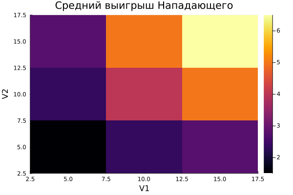
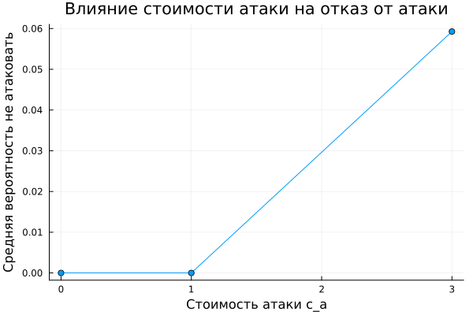

---
## Front matter
lang: ru-RU
title: Лабораторная работа №4
subtitle:  Методы математического моделирования в кибербезопасности. Практикум
author: |
        Коняева Марина Александровна
        \        
        НФИмд-01-25
        \
        Студ. билет: 1032259383
institute: |
           RUDN
date: | 
      2026

babel-lang: russian
babel-otherlangs: english
mainfont: Arial
monofont: Courier New
fontsize: 9pt

## Formatting
toc: false
slide_level: 2
theme: metropolis
header-includes: 
 - \metroset{progressbar=frametitle,sectionpage=progressbar,numbering=fraction}
 - '\makeatletter'
 - '\beamer@ignorenonframefalse'
 - '\makeatother'
aspectratio: 43
section-titles: true
---

# Цель работы


Освоить применение теории игр для анализа противостояния в сфере информационной безопасности. Научиться строить матричную игру, находить равновесие
Нэша в чистых и смешанных стратегиях.


# Задание

1. Формализовать конфликт «Защитник–Нападающий» в виде антагонистической игры.
2. Реализовать на Julia функции расчёта платёжной матрицы, поиска равновесия Нэша и симуляции игры.
3. Визуализировать зависимость ожидаемого выигрыша и равновесных вероятностей от стоимости защиты и величины ущерба.


# Теоретическое введение

Игроки:

* Нападающий (Attacker);
* Защитник (Defender).

Ожидаемые выигрыши:

$$
U_A(\mathbf{p},\mathbf{q})
$$

$$
\mathbf{p}^{T}A\mathbf{q}
$$

$$
U_D(\mathbf{p},\mathbf{q})
$$

$$
\mathbf{p}^{T}D\mathbf{q}
$$

# Теоретическое введение


Равновесие Нэша:

$$
U_A(\mathbf{p}^{*},\mathbf{q}^{*})
$$

$$
U_A(\mathbf{p},\mathbf{q}^{*})
$$

$$
U_D(\mathbf{p}^{*},\mathbf{q}^{*})
$$

$$
U_D(\mathbf{p}^{*},\mathbf{q})
$$

# Выполнение лабораторной работы

## Основной модуль simulation.jl

Реализованы функции:

* построения платёжных матриц;
* поиска равновесия Нэша;
* проведения симуляций;
* сохранения результатов;
* загрузки результатов.

Результат:

* файл `results.csv`;
* таблица с параметрами модели и найденными равновесиями.


# Выполнение лабораторной работы

## Запуск симуляций

Создан файл:

```julia
scripts/run_sims.jl
```

Выполнен расчёт всех комбинаций параметров:

* $V_1 \in {5,10,15}$
* $V_2 \in {5,10,15}$
* $c_a \in {0,1,3}$
* $c_d \in {0,1,3}$

Всего строк

$$
3 \times 3 \times 3 \times 3 = 81
$$


# Выполнение лабораторной работы

## Анализ результатов

{#fig-base width=70%}


# Выполнение лабораторной работы

## Анализ результатов

{#fig-base width=70%}


# Дополнительное задание

Добавлены новые стратегии:

Нападающий:

* Атаковать актив 1
* Атаковать актив 2
* Не атаковать

Защитник:

* Защищать актив 1
* Защищать актив 2
* Не защищать ничего

Размерность игры:

$$
2\times2
\rightarrow
3\times3
$$


# Дополнительное задание

## Влияние стоимости атаки

{#fig-base width=70%}

Рост стоимости атаки повышает вероятность выбора стратегии «Не атаковать».


# Дополнительное задание

## Влияние стоимости защиты

{#fig-base width=70%}

Рост стоимости защиты увеличивает вероятность выбора стратегии «Не защищать ничего».


# Дополнительное задание

## Сравнение моделей

{#fig-base width=70%}

Расширенная модель позволяет отказаться от невыгодных действий, поэтому демонстрирует более реалистичное поведение игроков.


# Контрольные вопросы

Рассмотрены:

* антагонистические игры;
* равновесие Нэша;
* смешанные стратегии;
* влияние стоимости атаки и защиты;
* практическое применение теории игр в информационной безопасности.

# Выводы

В ходе работы реализована модель конфликта «Защитник–Нападающий», выполнён поиск равновесий Нэша и проведено исследование влияния параметров модели на поведение игроков.

Дополнительно реализована расширенная версия игры с возможностью отказа от атаки и защиты. Полученные результаты показали, что новые стратегии делают модель более реалистичной и позволяют учитывать экономическую целесообразность действий сторон.


# Список литературы

1. Описание лабораторной работы