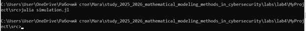
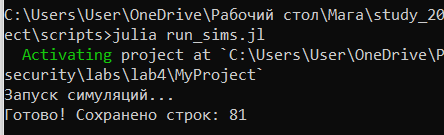
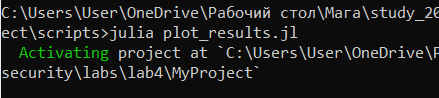
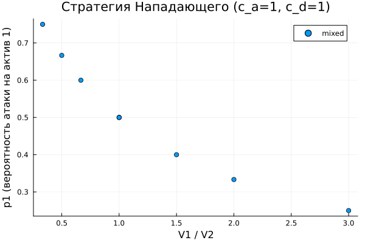
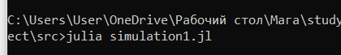
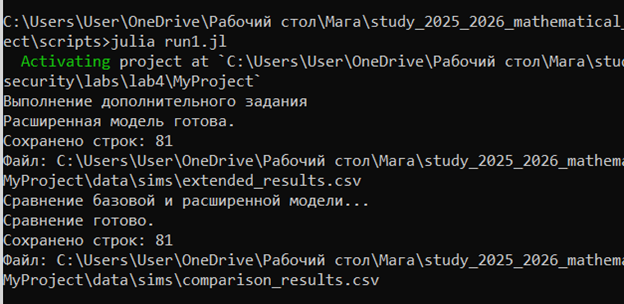
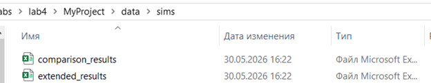
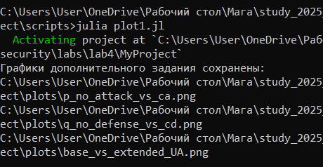
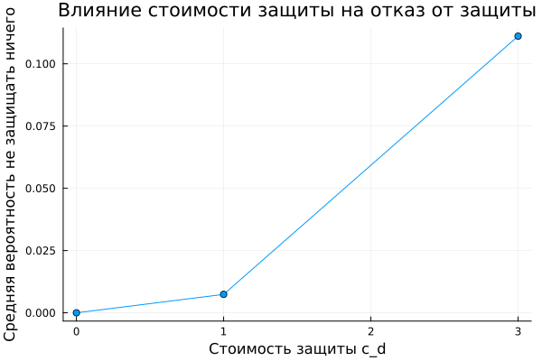
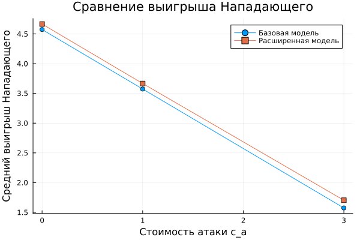

---
## Front matter
title: "ОТЧЕТ ПО ЛАБОРАТОРНОЙ РАБОТЕ №4"
subtitle: "Методы математического моделирования в кибербезопасности. Практикум"
author: "Коняева Марина Александровна"

## Generic otions
lang: ru-RU
toc-title: "Содержание"

## Bibliography
bibliography: bib/cite.bib
csl: pandoc/csl/gost-r-7-0-5-2008-numeric.csl

## Pdf output format
toc: true # Table of contents
toc-depth: 2
fontsize: 12pt
linestretch: 1.5
papersize: a4
documentclass: scrreprt
## I18n polyglossia
polyglossia-lang:
  name: russian
  options:
	- spelling=modern
	- babelshorthands=true
polyglossia-otherlangs:
  name: english
## I18n babel
babel-lang: russian
babel-otherlangs: english
# ## Fonts
#mainfont: PT Serif
#romanfont: PT Serif
#sansfont: PT Sans
#monofont: PT Mono
mainfontoptions: Ligatures=TeX
romanfontoptions: Ligatures=TeX
sansfontoptions: Ligatures=TeX,Scale=MatchLowercase
monofontoptions: Scale=MatchLowercase,Scale=0.9
## Biblatex
biblatex: true
biblio-style: "gost-numeric"
biblatexoptions:
  - parentracker=true
  - backend=biber
  - hyperref=auto
  - language=auto
  - autolang=other*
  - citestyle=gost-numeric
## Pandoc-crossref LaTeX customization
figureTitle: "Рис."
tableTitle: "Таблица"
listingTitle: "Листинг"
lolTitle: "Листинги"
## Misc options
indent: true
header-includes:
  - \usepackage{indentfirst}
  - \usepackage{float} # keep figures where there are in the text
  - \floatplacement{figure}{H} # keep figures where there are in the text
---


# Цель работы

Освоить применение теории игр для анализа противостояния в сфере информационной безопасности. Научиться строить матричную игру, находить равновесие
Нэша в чистых и смешанных стратегиях.


# Задание

1. Формализовать конфликт «Защитник–Нападающий» в виде антагонистической игры.
2. Реализовать на Julia функции расчёта платёжной матрицы, поиска равновесия Нэша и симуляции игры.
3. Визуализировать зависимость ожидаемого выигрыша и равновесных вероятностей от стоимости защиты и величины ущерба.


# Теоретическое введение

Модель «Защитник–Нападающий» основана на аппарате теории игр и используется для анализа противостояния между Защитником, стремящимся минимизировать ущерб, и Нападающим, стремящимся его максимизировать. Основными элементами модели являются игроки, доступные им стратегии и функции выигрыша, определяющие результат взаимодействия [@osborne_game_theory; @tadelis_game_theory].

Рассматривается статическая биматричная игра с неполной информацией, в которой игроки принимают решения одновременно. Пусть имеется множество активов информационной системы

$$
A={1,2,\ldots,n},
$$

где каждый актив характеризуется ценностью $V_i>0$. В базовой версии модели рассматриваются два актива ($n=2$).

Нападающий выбирает актив для атаки, а Защитник — актив для усиленной защиты. В смешанных стратегиях действия игроков задаются вероятностными векторами

$$
\mathbf{p}=(p_1,\ldots,p_n),
$$

$$
\mathbf{q}=(q_1,\ldots,q_n),
$$

где

$$
\sum_{i=1}^{n} p_i = 1,
$$

$$
\sum_{j=1}^{n} q_j = 1.
$$

Дополнительно учитываются стоимость атаки $c_a$ и стоимость защиты $c_d$.

Если атакуемый актив не защищён ($i \ne j$), атака считается успешной. Тогда выигрыши игроков определяются выражениями

$$
A_{ij}=V_i-c_a,
$$

$$
D_{ij}=-V_i-c_d.
$$

Если атака направлена на защищённый актив ($i=j$), она отражается, и игроки несут только свои затраты:

$$
A_{ii}=-c_a,
$$

$$
D_{ii}=-c_d.
$$

Игра описывается двумя платёжными матрицами

$$
A=(A_{ij}),
$$

$$
D=(D_{ij}).
$$

При использовании смешанных стратегий ожидаемые выигрыши игроков вычисляются как

$$
U_A(\mathbf{p},\mathbf{q})\mathbf{p}^{T}A\mathbf{q},
$$

$$
U_D(\mathbf{p},\mathbf{q})\mathbf{p}^{T}D\mathbf{q}.
$$

Пара стратегий $(\mathbf{p}^{*},\mathbf{q}^{*})$ образует равновесие Нэша, если ни одному игроку не выгодно изменять свою стратегию в одностороннем порядке:

$$
U_A(\mathbf{p}^{*},\mathbf{q}^{*})
$$

$$
U_A(\mathbf{p},\mathbf{q}^{*}),
$$

$$
U_D(\mathbf{p}^{*},\mathbf{q}^{*})
$$

$$
U_D(\mathbf{p}^{*},\mathbf{q}).
$$

Равновесие может существовать как в чистых, так и в смешанных стратегиях. Для игры размерности $2\times2$ смешанное равновесие определяется из условия безразличия игроков:

$$
A_{11}q_1+A_{12}(1-q_1)
$$

$$
A_{21}q_1+A_{22}(1-q_1),
$$

$$
p_1D_{11}+(1-p_1)D_{21}
$$

$$
p_1D_{12}+(1-p_1)D_{22}.
$$

Поведение модели зависит от соотношения ценности активов и затрат игроков. При одинаковой ценности активов обычно возникает смешанное равновесие, при значительном превосходстве одного актива возможно чистое равновесие с его постоянной атакой и защитой. Увеличение стоимости защиты снижает вероятность её применения, а рост стоимости атаки делает Нападающего более осторожным.

В задачах информационной безопасности смешанные стратегии позволяют повысить непредсказуемость системы защиты за счёт случайного распределения ресурсов, ротации средств мониторинга и использования ловушек. Равновесие Нэша обеспечивает выбор стратегии, минимизирующей ожидаемый ущерб при рациональном поведении противника.

Модель имеет ряд ограничений: игроки делают ход только один раз, параметры считаются известными заранее, активы предполагаются независимыми, а базовая версия модели не предусматривает возможность отказа от атаки или защиты.


# Выполнение лабораторной работы

1. Создание рабочего каталога среды и проверка наличия всех необходимых пакетов Julia [@julia:official; @drwatson:docs; @graphs:julia].

```
using Pkg
Pkg.activate(".")
Pkg.add("DrWatson")
Pkg.add("Plots")
Pkg.add("StatsPlots")
Pkg.add("DataFrames")
Pkg.add("JLD2")
Pkg.add("Random")
Pkg.add("Statistics")
Pkg.add("CSV")
```

2. Создадим файл `src/simulation.jl`, содержащий основные функции моделирования конфликта «Защитник–Нападающий». Модуль реализует построение платёжных матриц, поиск равновесия Нэша, проведение серии симуляций и сохранение результатов для последующего анализа.

Функция `build_payoff_matrices()` формирует платёжные матрицы Нападающего и Защитника на основе ценности активов, стоимости атаки и стоимости защиты. Если атакуемый актив не защищён, Нападающий получает выигрыш, а Защитник несёт ущерб. Если атака направлена на защищённый актив, она считается отражённой. Результатом работы функции являются две платёжные матрицы `A` и `D`.

Функция `mixed_nash_2x2()` выполняет поиск равновесия Нэша для игры размерности $2\times2$. Сначала производится проверка существования равновесия в чистых стратегиях. Если такое равновесие отсутствует, вычисляется смешанное равновесие на основе условия безразличия игроков. Результатом работы функции являются равновесные стратегии Нападающего и Защитника, а также тип найденного равновесия (`pure` или `mixed`).

Функция `run_simulation()` проводит один вычислительный эксперимент. На основе заданных параметров строятся платёжные матрицы, определяется равновесие Нэша и вычисляются ожидаемые выигрыши игроков. Результатом работы функции является словарь с параметрами модели, вероятностями выбора стратегий, типом равновесия и ожидаемыми выигрышами игроков.

Функция `generate_params()` формирует набор параметров для симуляционного эксперимента. Перебираются различные сочетания ценностей активов, стоимости атаки и стоимости защиты. Результатом работы функции является массив словарей, содержащих все исследуемые комбинации параметров.

Функция `main_simulations()` запускает серию экспериментов для всех комбинаций параметров, собирает результаты в таблицу `DataFrame` и сохраняет их в файл `data/sims/results.csv`. Результатом работы функции является таблица результатов моделирования и CSV-файл с данными для последующего анализа.

Функция `load_results()` предназначена для загрузки ранее сохранённых результатов моделирования из CSV-файла. 

Результатом работы функции является объект `DataFrame`, содержащий все рассчитанные параметры и показатели игры.

{#fig-base width=80%}

3. Создадим файл `scripts/run_sims.jl`, который выполняет запуск серии вычислительных экспериментов для всех комбинаций параметров модели.

Скрипт подключает основной модуль `simulation.jl`, выводит сообщение о начале вычислений и вызывает функцию `main_simulations()`, которая последовательно проводит моделирование для всех сформированных наборов параметров. После завершения расчётов в консоль выводится количество обработанных сценариев.

В данной работе рассматриваются все комбинации значений ценности активов $V_1$, $V_2$, стоимости атаки $c_a$ и стоимости защиты $c_d$, сформированные функцией `generate_params()`. Всего рассчитывается 81 вариант модели.

Результатом работы скрипта является таблица результатов в формате `DataFrame`, содержащая найденные равновесия Нэша, вероятности выбора стратегий и ожидаемые выигрыши игроков. Дополнительно результаты автоматически сохраняются в файл `data/sims/results.csv`, который в дальнейшем используется для анализа и построения графиков.


{#fig-base width=80%}

{#fig-base width=80%}


4. Создадим файл `scripts/plot_results.jl`, предназначенный для визуального анализа результатов моделирования.

Скрипт загружает ранее рассчитанные данные из файла `data/sims/results.csv` с помощью функции `load_results()`. Для более наглядного исследования выбираются результаты при фиксированных значениях стоимости атаки и защиты ($c_a = 1$, $c_d = 1$).

На первом этапе строится точечный график зависимости вероятности атаки первого актива $p_1$ от отношения ценностей активов $V_1/V_2$. Дополнительно точки разделяются по типу найденного равновесия Нэша (чистое или смешанное), что позволяет визуально оценить влияние соотношения ценностей активов на выбор стратегии Нападающего. Результат сохраняется в файл `plots/p1_vs_ratio.png`.

На втором этапе выполняется группировка данных по значениям $V_1$ и $V_2$, после чего для каждой комбинации вычисляется средний ожидаемый выигрыш Нападающего. На основе полученных значений строится тепловая карта, отражающая влияние ценности активов на ожидаемый результат атаки. Результат сохраняется в файл `plots/heatmap_UA.png`.

{#fig-base width=80%}

В результате работы скрипта формируются графики, позволяющие проанализировать характер равновесий и влияние параметров модели на ожидаемые выигрыши игроков.

{#fig-base width=80%}

По результатам построения графика зависимости вероятности атаки первого актива от отношения $V_1/V_2$ видно, что при увеличении относительной ценности первого актива вероятность его выбора в качестве цели атаки возрастает. Это соответствует логике модели, поскольку рациональный Нападающий стремится атаковать актив, способный принести наибольший выигрыш. Для исследуемых параметров наблюдаются преимущественно смешанные равновесия, что свидетельствует о необходимости рандомизации действий обеими сторонами.

{#fig-base width=80%}

Тепловая карта среднего выигрыша Нападающего показывает, что ожидаемый выигрыш увеличивается по мере роста ценности активов. Максимальные значения наблюдаются при больших значениях $V_1$ и $V_2$, когда потенциальная выгода от успешной атаки значительно превышает затраты на её проведение. Таким образом, ценность защищаемых ресурсов оказывает существенное влияние на поведение игроков и итоговое равновесие.


5. Выполним дополнительное задание: добавьте третью стратегию для Защитника «Не защищать ничего» и для Нападающего «Не атаковать». Платёжная матрица изменится. Модифицируйте функции и исследуйте, как меняется равновесие. Сравните результаты с базовой моделью.

Для выполнения дополнительного задания базовая модель была расширена добавлением новой стратегии для каждого игрока:

* для Нападающего — «Не атаковать»;
* для Защитника — «Не защищать ничего».

В результате игра размерности $2\times2$ была преобразована в игру $3\times3$. Расширенная реализация была добавлена в файл `src/simulation1.jl`.

Функция `build_extended_payoff_matrices()` формирует расширенные платёжные матрицы размерности $3\times3$. Дополнительно учитываются ситуации, когда Нападающий отказывается от атаки или Защитник отказывается от защиты. Если оба игрока выбирают бездействие, их выигрыши принимаются равными нулю. Результатом работы функции являются расширенные платёжные матрицы Нападающего и Защитника.

Для поиска равновесия Нэша в игре размерности $3\times3$ реализован алгоритм Support Enumeration. Вспомогательная функция `combinations_vec()` формирует все возможные опоры стратегий заданного размера, а функция `solve_support_equilibrium()` вычисляет равновесие для выбранной пары опор и проверяет выполнение условий Нэша.

Функция `nash_equilibrium_support_enumeration()` последовательно перебирает все возможные комбинации опор стратегий и выполняет поиск равновесия Нэша. В отличие от базовой версии лабораторной работы, данный алгоритм позволяет находить как чистые, так и смешанные равновесия в игре размерности $3\times3$.

Функция `run_extended_simulation()` проводит один вычислительный эксперимент для расширенной модели. На основе заданных параметров строятся расширенные платёжные матрицы, вычисляется равновесие Нэша и определяются ожидаемые выигрыши игроков. Результатом работы функции является словарь, содержащий вероятности выбора всех стратегий, включая стратегии «Не атаковать» и «Не защищать ничего», а также ожидаемые выигрыши игроков.

Функция `main_extended_simulations()` выполняет серию вычислительных экспериментов для всех комбинаций параметров и сохраняет результаты в файл `data/sims/extended_results.csv`. Результатом работы функции является таблица результатов расширенной модели.

Для сравнения базовой и расширенной моделей реализована функция `compare_base_and_extended()`. Для каждого набора параметров вычисляются характеристики обеих моделей, после чего формируется сравнительная таблица и сохраняется в файл `data/sims/comparison_results.csv`. Полученные данные используются для анализа влияния новых стратегий на структуру равновесия и ожидаемые выигрыши игроков.


{#fig-base width=80%}

6. Создадим файл `scripts/run_extended_sims.jl`, который выполняет запуск серии вычислительных экспериментов для расширенной модели конфликта «Защитник–Нападающий».

Скрипт подключает модуль `simulation1.jl`, содержащий реализацию дополнительного задания, после чего запускает функцию `main_extended_simulations()`. В ходе работы рассчитываются равновесия Нэша для всех комбинаций параметров с учётом новых стратегий «Не атаковать» и «Не защищать ничего». Результаты сохраняются в файл `data/sims/extended_results.csv`.

После завершения расчётов выполняется функция `compare_base_and_extended()`, которая для каждого набора параметров сравнивает характеристики базовой и расширенной моделей. Полученные данные сохраняются в файл `data/sims/comparison_results.csv`.

В результате работы скрипта формируются две таблицы данных: первая содержит результаты расширенной модели, а вторая — результаты сравнения базовой и расширенной моделей. Эти данные используются для дальнейшего анализа влияния новых стратегий на структуру равновесия Нэша и ожидаемые выигрыши игроков.
 
{#fig-base width=80%}

{#fig-base width=80%}


7. Создадим файл `scripts/plot_extended.jl`, предназначенный для анализа результатов расширенной модели и сравнения её с базовой версией игры.

Скрипт загружает данные из файлов `extended_results.csv` и `comparison_results.csv`, сформированных на предыдущем этапе. После загрузки выполняется обработка результатов и построение графиков, отражающих влияние новых стратегий на поведение игроков.

На первом этапе вычисляется средняя вероятность выбора стратегии «Не атаковать» для различных значений стоимости атаки $c_a$. По полученным данным строится график зависимости вероятности отказа от атаки от стоимости атаки. Результат сохраняется в файл `plots/p_no_attack_vs_ca.png`.

На втором этапе вычисляется средняя вероятность выбора стратегии «Не защищать ничего» для различных значений стоимости защиты $c_d$. На основе этих данных строится график зависимости вероятности отказа от защиты от стоимости защиты. Результат сохраняется в файл `plots/q_no_defense_vs_cd.png`.

На третьем этапе выполняется сравнение среднего ожидаемого выигрыша Нападающего в базовой и расширенной моделях. Для каждого значения стоимости атаки рассчитываются средние выигрыши, после чего строится сравнительный график. Результат сохраняется в файл `plots/base_vs_extended_UA.png`.

{#fig-base width=80%}


В результате работы скрипта формируются три графика, позволяющие оценить влияние новых стратегий на структуру равновесия Нэша и сравнить поведение игроков в базовой и расширенной моделях.

{#fig-base width=80%}


Из графика видно, что при увеличении стоимости атаки возрастает вероятность выбора стратегии «Не атаковать». При низких значениях $c_a$ отказ от атаки практически не наблюдается, поскольку потенциальный выигрыш превышает затраты. При увеличении стоимости атаки стратегия бездействия становится более привлекательной, что подтверждает экономическую обоснованность введённой стратегии.

{#fig-base width=80%}


Полученные результаты показывают, что рост стоимости защиты приводит к увеличению вероятности выбора стратегии «Не защищать ничего». Если защитные мероприятия становятся слишком затратными, Защитник предпочитает отказаться от дополнительных расходов. Это демонстрирует влияние экономических факторов на выбор оптимальной стратегии защиты.

{#fig-base width=80%}


Сравнение базовой и расширенной моделей показывает, что средний выигрыш Нападающего в расширенной модели оказывается немного выше. Причиной является появление возможности отказаться от заведомо невыгодной атаки и избежать лишних затрат. В базовой модели такой возможности нет, поэтому Нападающий вынужден совершать атаку даже в неблагоприятных условиях. Следовательно, введение стратегии «Не атаковать» делает модель более реалистичной и гибкой.


8. Литературный стиль. Преобразовываем в производные форматы с помощью файла *tangle.jl*

9. Выполним те же действия лабораторной работы в  jupyter notebook и получим те же результаты.

10. Ответим на контрольные вопросы:

- Что такое антагонистическая игра? Почему модель «Защитник–Нападающий» можно считать игрой с нулевой суммой?

Антагонистическая игра — это игра, в которой интересы игроков полностью противоположны: выигрыш одного игрока приводит к проигрышу другого.

В модели «Защитник–Нападающий» успешная атака приносит Нападающему выигрыш, связанный с ценностью атакуемого актива:

$$
U_A = V_i - c_a,
$$

а Защитник при этом несёт ущерб:

$$
U_D = -V_i - c_d.
$$

Таким образом, увеличение выигрыша Нападающего сопровождается уменьшением выигрыша Защитника. Поэтому данную модель можно рассматривать как приближение к игре с нулевой суммой, в которой интересы сторон являются противоположными.

- Дайте определение равновесия Нэша в чистых и смешанных стратегиях. Приведите пример, когда равновесия в чистых стратегиях не существует.

Равновесием Нэша называется такая пара стратегий игроков, при которой ни одному игроку не выгодно изменять свою стратегию в одностороннем порядке:

$$
U_A(\mathbf{p}^{*},\mathbf{q}^{*})
$$

$$
U_A(\mathbf{p},\mathbf{q}^{*}),
$$

$$
U_D(\mathbf{p}^{*},\mathbf{q}^{*})
$$

$$
U_D(\mathbf{p}^{*},\mathbf{q}).
$$

В чистом равновесии игроки всегда выбирают одну и ту же стратегию с вероятностью 1. В смешанном равновесии игроки используют вероятностное распределение между несколькими стратегиями.

Пример отсутствия чистого равновесия возникает при одинаковой ценности активов и отсутствии затрат:

$$
V_1 = V_2,
$$

$$
c_a = c_d = 0.
$$

В этом случае игрокам выгодно использовать смешанные стратегии и случайным образом выбирать свои действия.

- Как изменится равновесная стратегия Защитника, если ущерб от успешной атаки на незащищённый сервер станет бесконечно большим?

Если ценность актива стремится к бесконечности

$$
V_1 \rightarrow \infty,
$$

то потеря данного актива становится недопустимой для Защитника. В равновесии вероятность защиты этого актива будет стремиться к единице:

$$
q_1 \rightarrow 1.
$$

Следовательно, Защитник будет практически всегда выбирать защиту наиболее критичного актива, поскольку потенциальный ущерб значительно превышает стоимость защиты.

- Зачем в информационной безопасности применяют смешанные стратегии? Приведите реальные примеры рандомизации в защите.

Смешанные стратегии используются для снижения предсказуемости поведения системы защиты. Если действия Защитника заранее известны, Нападающий может адаптировать свои действия и повысить вероятность успешной атаки.

Примерами применения смешанных стратегий в информационной безопасности являются:

* случайная ротация средств мониторинга и контроля;
* использование honeypot-систем и ложных сервисов;
* случайный выбор объектов для аудита безопасности;
* динамическое перераспределение ресурсов защиты между активами;
* периодическое изменение политик доступа и правил фильтрации трафика.

Использование рандомизации затрудняет прогнозирование действий Защитника и повышает устойчивость информационной системы к атакам.


# Выводы

В ходе выполнения лабораторной работы были изучены методы применения теории игр для моделирования конфликтов в сфере информационной безопасности. Реализована модель «Защитник–Нападающий», построены платёжные матрицы игроков, разработаны алгоритмы поиска равновесия Нэша в чистых и смешанных стратегиях, а также проведена серия симуляционных экспериментов для различных значений ценности активов и затрат на атаку и защиту [@osborne_game_theory; @tadelis_game_theory].

В результате моделирования были рассчитаны равновесные стратегии игроков, определены ожидаемые выигрыши Нападающего и Защитника, а также исследовано влияние параметров модели на характер равновесия. Построенные графики позволили проанализировать зависимость вероятностей выбора стратегий и выигрышей игроков от соотношения ценности активов и величины затрат.

В рамках дополнительного задания модель была расширена добавлением стратегий «Не атаковать» и «Не защищать ничего», что привело к переходу от игры размерности $2\times2$ к игре $3\times3$. Для поиска равновесий Нэша был реализован алгоритм Support Enumeration, позволяющий находить равновесия в играх большей размерности. Выполнено сравнение базовой и расширенной моделей, показавшее влияние новых стратегий на поведение игроков и ожидаемые выигрыши.

Полученные результаты подтверждают, что теория игр является эффективным инструментом анализа противостояния между Защитником и Нападающим, а использование смешанных стратегий позволяет учитывать неопределённость и повышать реалистичность моделей информационной безопасности.


# Список литературы

\printbibliography